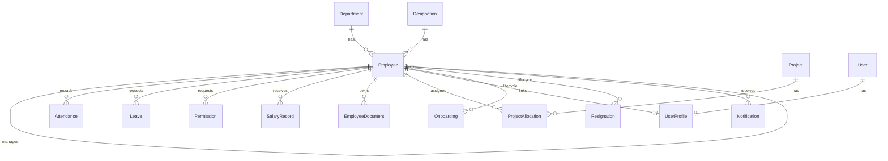

# HRMS — Human Resource Management System

Enterprise-oriented HRMS for internal company use: Django REST API backend, PostgreSQL database, PyQt6 desktop client, Docker deployment.

---

## Project Overview

Monorepo with two runtimes:

| Component | Technology | Purpose |
|-----------|------------|---------|
| Backend API | Django 6 + DRF + SimpleJWT | REST API, RBAC, business logic |
| Database | PostgreSQL 16 | Persistent data |
| Desktop client | PyQt6 | HR / Manager / Employee UI |
| Deployment | Docker Compose + Gunicorn | API + DB containers |

The desktop client calls the API over HTTP. It is **not** containerized; only backend + PostgreSQL run in Docker.

**Verified (codebase, 2026):** 21 domain models, 100+ HTTP routes, 61 backend tests, 15 PyQt screens, 24 migrations, GitHub Actions CI.

---

## Features

| Module | Capabilities |
|--------|--------------|
| **Employees** | CRUD, department/designation, education, bank, ID proofs, emergency contacts |
| **Attendance** | Records, check-in/out, summary, reports, payroll cycle (26th–25th) |
| **Leaves** | Requests, approval/rejection, balance, history |
| **Permissions** | Short leave requests, approval workflow |
| **Projects** | Projects, allocations, headcount, employee self-update |
| **Documents** | Upload, categories, download, PDF generation (offer/appointment/experience) |
| **Lifecycle** | Onboarding, resignations, joining letters, document checklist |
| **Payroll** | Salary records, payslip PDF |
| **Notifications** | In-app alerts, birthdays, anniversaries, unread count |
| **Dashboard** | Stats, analytics charts, insights |
| **Reports** | Attendance, leave, payroll, attrition, project headcount |
| **ESS** | Self-service profile, attendance, leaves, payslips, documents |
| **Directory** | Employee directory |
| **Auth** | JWT login, role-based permissions, audit log |

---

## System Architecture

```
┌─────────────────┐     HTTP/JSON      ┌──────────────────────────┐
│  PyQt6 Desktop  │ ─────────────────► │  Django + DRF + Gunicorn │
│  (frontend/)    │     JWT Bearer     │  (backend/)              │
└─────────────────┘                    └────────────┬─────────────┘
                                                    │
                                                    ▼
                                         ┌──────────────────────┐
                                         │  PostgreSQL 16       │
                                         └──────────────────────┘
```

**Processing modes:**

1. **Local development** — Django `runserver` or Gunicorn on host; PostgreSQL on localhost; PyQt on host.
2. **Docker** — `db` + `backend` containers; PyQt still on host pointing to `http://127.0.0.1:8000/api`.

---

## Technology Stack

| Layer | Stack |
|-------|-------|
| Language | Python 3.12 |
| Web framework | Django 6.0.6 |
| API | Django REST Framework 3.17 |
| Auth | djangorestframework-simplejwt 5.5 |
| Database | PostgreSQL only (`psycopg2-binary`) |
| API docs | drf-spectacular |
| CORS | django-cors-headers |
| Desktop | PyQt6 6.11 |
| HTTP client | requests |
| Export | openpyxl |
| WSGI (prod) | Gunicorn |
| CI | GitHub Actions |

---

## Folder Structure

```
hrms-system/
├── .github/workflows/ci.yml    # CI pipeline
├── .env.example                # Docker Compose DB vars (repo root)
├── production.env.example      # Production backend template
├── requirements.txt            # Backend deps (Docker + pip install)
├── Dockerfile                  # Backend image
├── docker-compose.yml          # db + backend services
├── scripts/
│   ├── backup_postgres.ps1
│   ├── backup_postgres.sh
│   └── restore_postgres.ps1
├── backend/
│   ├── manage.py
│   ├── .env.example
│   ├── config/                 # settings, urls, health, cycle, dates
│   ├── authentication/         # JWT, RBAC, audit
│   ├── employees/
│   ├── attendance/
│   ├── leaves/
│   ├── projects/
│   ├── documents/
│   ├── lifecycle/
│   ├── notifications/
│   ├── payroll/
│   └── dashboard/              # stats, reports (no models)
└── frontend/
    ├── main.py                 # Recommended entry point
    ├── login_window.py
    ├── dashboard.py            # Main shell + 15 menu items
    ├── api_service.py          # REST client
    ├── ui_helpers.py           # Loading, errors
    ├── table_utils.py          # Tables, pagination, export
    ├── *_window.py             # Feature screens (16)
    ├── *_form.py               # Dialog forms (13)
    ├── requirements.txt
    └── .env.example
```

---

## Database Design

### Entity relationship (core)



### Models by app (21 total)

| App | Models |
|-----|--------|
| employees | Department, Designation, Employee, Education, BankDetails, IDProof, EmergencyContact |
| attendance | Attendance |
| leaves | Leave, Permission |
| projects | Project, ProjectAllocation |
| documents | DocumentCategory, EmployeeDocument |
| lifecycle | Onboarding, Resignation |
| notifications | Notification |
| payroll | SalaryRecord |
| authentication | UserProfile, AuditLog |

### Indexes (verified in models)

- `attendance`: `(employee, date)`, `(date, status)`
- `leaves`: `(employee, status)`, `(status, created_at)`, permission `(date)`
- `payroll`: `(employee, period)` unique
- `documents`: `(employee, uploaded_at)`, `(category)`
- `projects`: `(status)`, allocation `(employee, released_on)`
- `employees`: `(status)`, `(department)`
- `audit`: `(action, created_at)`

---

## API Architecture

- **Base URL:** `http://<host>:8000/api/`
- **Auth:** `POST /api/token/` → `{access, refresh}`; header `Authorization: Bearer <access>`
- **Refresh:** `POST /api/token/refresh/`
- **Identity:** `GET /api/me/` → role + permission flags
- **OpenAPI:** `GET /api/schema/`, Swagger UI at `/api/docs/`
- **Health:** `GET /api/health/`, `GET /api/health/ready/`

### Endpoint groups

| Prefix | Resource |
|--------|----------|
| `/api/employees/`, `/departments/`, `/designations/`, `/education/`, `/bank-details/`, `/id-proofs/`, `/emergency-contacts/` | Employee master |
| `/api/attendance/` | Attendance + check-in/out/summary/report/history |
| `/api/leaves/`, `/api/permissions/` | Leave & permission workflows |
| `/api/projects/`, `/api/allocations/` | Projects & staffing |
| `/api/documents/`, `/api/document-categories/` | Document management |
| `/api/onboardings/`, `/api/resignations/` | Lifecycle |
| `/api/notifications/` | Notifications |
| `/api/salaries/` | Payroll |
| `/api/dashboard/` | Stats, analytics, insights |
| `/api/reports/` | Report exports (JSON) |

---

## Authentication Flow

1. PyQt `LoginWindow` → `APIService.login(username, password)`
2. `POST /api/token/` with JSON body
3. On 200: store `access` + `refresh` tokens
4. `GET /api/me/` loads role and 13 permission flags
5. Subsequent calls: `Authorization: Bearer <access>`
6. On 401: automatic refresh via `/api/token/refresh/`; on failure → session expired dialog
7. Login/throttle: 20/min; refresh: 60/min (configurable)

---

## RBAC Architecture

### Roles

| Role | Django group | Data scope |
|------|--------------|------------|
| **HR** | `HR` | All employees, all modules (write) |
| **Manager** | `Manager` | Self + direct reports |
| **Employee** | `Employee` | Self only |

### Permission flags (`GET /api/me/`)

`full_access`, `manage_employees`, `manage_attendance`, `approve_leave`, `manage_payroll`, `manage_documents`, `manage_projects`, `view_reports`, `manage_lifecycle`, `view_directory`, `self_service`, `view_notifications`, `manage_departments`

### Enforcement

- DRF classes: `IsHROrReadOnly`, `IsManagerOrHR`, `IsHROrManagerOrReadOnly`
- Queryset scoping: `filter_employees_for_user`, `filter_by_employee_scope`, `filter_projects_for_user` in `authentication/rbac.py`

---

## Module Flows (summary)

### Document generation

HR → Documents → Generate → `POST /api/documents/generate/` → PDF in `media/employee_documents/`

### Payroll

HR → Payroll → `POST /api/salaries/` → `GET /api/salaries/{id}/payslip/` (PDF)

### Attendance

Records via API; cycle boundaries from `config/cycle.py` (26th–25th)

### Notifications

Scheduled via `python manage.py generate_notifications` or `POST /api/notifications/generate/`

### Dashboard

`refresh_dashboard()` → stats + analytics + insights APIs → charts in PyQt

---

## System Requirements

### Hardware (minimum)

| Component | Minimum |
|-----------|---------|
| Dev workstation | 4 GB RAM, 2 CPU cores, 10 GB disk |
| Docker host | 4 GB RAM for Postgres + Gunicorn |
| Desktop clients | 4 GB RAM, 1280×720 display |

### Software

| Software | Version |
|----------|---------|
| Python | 3.12 |
| PostgreSQL | 14+ (16 in Docker) |
| Docker Desktop | Latest (for container deploy) |
| Git | 2.x |
| pg_dump / psql | For backups (optional locally) |

---

## Prerequisites

1. Python 3.12 installed
2. PostgreSQL installed and running (local dev) **or** Docker Desktop (container deploy)
3. Git

---

## Installation

```powershell
git clone <repository-url>
cd hrms-system
```

### Backend virtual environment

```powershell
cd backend
python -m venv venv
.\venv\Scripts\activate
pip install -r ..\requirements.txt
copy .env.example .env
# Edit backend\.env — set DB_PASSWORD and SECRET_KEY
```

### Frontend virtual environment

```powershell
cd ..\frontend
python -m venv venv
.\venv\Scripts\activate
pip install -r requirements.txt
copy .env.example .env
```

---

## PostgreSQL Setup (local)

```sql
CREATE DATABASE hrms_db;
CREATE USER postgres WITH PASSWORD 'your_password';
GRANT ALL PRIVILEGES ON DATABASE hrms_db TO postgres;
```

Set matching values in `backend/.env`:

```
DB_NAME=hrms_db
DB_USER=postgres
DB_PASSWORD=your_password
DB_HOST=localhost
DB_PORT=5432
```

---

## Database Migration Commands

```powershell
cd backend
.\venv\Scripts\activate
python manage.py migrate
python manage.py makemigrations --check   # CI: must show "No changes detected"
```

---

## Seed Commands

```powershell
# Demo users: hr_demo / mgr_demo / emp_demo (default password demo1234)
python manage.py seed_demo_data
python manage.py seed_demo_data --password YourPassword

# Sync Django groups with UserProfile roles
python manage.py sync_hrms_groups

# Audit RBAC consistency
python manage.py audit_permissions

# Generate notification alerts
python manage.py generate_notifications
```

---

## Running Backend (local)

```powershell
cd backend
.\venv\Scripts\activate
python manage.py runserver 0.0.0.0:8000
```

Verify:

- http://127.0.0.1:8000/api/health/
- http://127.0.0.1:8000/api/docs/

---

## Running Frontend

```powershell
cd frontend
.\venv\Scripts\activate
python main.py
```

`frontend/.env` (optional):

```
HRMS_API_URL=http://127.0.0.1:8000/api
```

Default if unset: `http://127.0.0.1:8000/api`

---

## Docker Setup

### 1. Configure environment

```powershell
copy .env.example .env
copy backend\.env.example backend\.env
```

**Important:** Repo-root `.env` `DB_PASSWORD` must match the PostgreSQL Docker volume credentials. `backend/.env` is used inside containers; `DB_HOST` is overridden to `db` by Compose.

### 2. Build and run

```powershell
docker compose build
docker compose up -d
docker compose ps
```

Startup sequence (backend container):

1. `python manage.py migrate --noinput`
2. `python manage.py collectstatic --noinput`
3. `gunicorn config.wsgi:application --bind 0.0.0.0:8000 --workers 3 --timeout 120`

### 3. Volumes

| Volume | Mount |
|--------|-------|
| `postgres_data` | PostgreSQL data |
| `media_data` | Uploaded/generated documents |
| `static_data` | Collected static files |
| `log_data` | Application logs |

### 4. Health checks

- DB: `pg_isready`
- Backend: HTTP GET `/api/health/` inside container
- Both services: `restart: unless-stopped`

---

## Environment Variables

### Backend (`backend/.env`)

| Variable | Required (prod) | Description |
|----------|-----------------|-------------|
| `SECRET_KEY` | Yes | Django secret; must not be default when DEBUG=False |
| `DEBUG` | Yes | `True` dev, `False` production |
| `ALLOWED_HOSTS` | Yes (prod) | Comma-separated hostnames |
| `DB_NAME`, `DB_USER`, `DB_PASSWORD`, `DB_HOST`, `DB_PORT` | Yes (prod) | PostgreSQL connection |
| `CORS_ALLOW_ALL_ORIGINS` | Yes (prod) | Must be `False` in production |
| `CORS_ALLOWED_ORIGINS` | Yes (prod) | Allowed origins list |
| `JWT_ACCESS_MINUTES` | No | Default 60 |
| `JWT_REFRESH_DAYS` | No | Default 1 |
| `HRMS_LOGIN_THROTTLE` | No | Default `20/minute` |
| `HRMS_MAX_UPLOAD_BYTES` | No | Default 5 MB |
| `LOG_DIR`, `LOG_LEVEL` | No | Logging |

See `backend/.env.example` and `production.env.example` for full list.

### Frontend (`frontend/.env`)

| Variable | Description |
|----------|-------------|
| `HRMS_API_URL` | API base including `/api` suffix |

### Docker Compose (repo root `.env`)

| Variable | Description |
|----------|-------------|
| `DB_NAME`, `DB_USER`, `DB_PASSWORD` | Substituted into Postgres service |

---

## Running Tests

```powershell
cd backend
.\venv\Scripts\activate
python manage.py check
python manage.py test
python manage.py makemigrations --check
```

With coverage:

```powershell
coverage run --source=authentication,employees,attendance,leaves,projects,documents,lifecycle,notifications,payroll,dashboard,config manage.py test
coverage report
```

Frontend compile check:

```powershell
cd frontend
python -m compileall . -x venv
```

---

## Running CI

Pipeline: `.github/workflows/ci.yml`

Triggers: push/PR to `main`, `master`, `develop`

Jobs:

1. **backend** — Postgres service, `check`, `makemigrations --check`, `test`
2. **frontend** — `compileall`
3. **docker** — `docker compose build`

---

## Backup & Restore

### Management command

```powershell
cd backend
python manage.py backup_db
python manage.py backup_db --include-media
python manage.py backup_db --output-dir backups
```

Requires `pg_dump` on PATH.

### Scripts

```powershell
.\scripts\backup_postgres.ps1
.\scripts\restore_postgres.ps1 -DumpFile backups\hrms_hrms_db_YYYYMMDD.dump
```

---

## Health Checks

| Endpoint | Purpose |
|----------|---------|
| `GET /api/health/` | Liveness (no DB required) |
| `GET /api/health/ready/` | Readiness (DB ping) |

---

## Logging

| Location | Content |
|----------|---------|
| `backend/logs/hrms.log` | General application log |
| `backend/logs/hrms-error.log` | ERROR+ only |
| `frontend/logs/hrms-client.log` | Desktop client |
| `frontend/logs/hrms-client-error.log` | Client errors + uncaught exceptions |

---

## Troubleshooting

### "Network error" on login (fixed)

**Cause:** `requests` Response objects are falsy for HTTP 4xx; old code used `if not response:`.

**Fix:** Use `response is None` for missing responses; check `response.status_code` for errors.

### "Could not reach server" with backend running

1. Confirm `HRMS_API_URL=http://127.0.0.1:8000/api` in `frontend/.env`
2. Test: `curl http://127.0.0.1:8000/api/health/`
3. Check `frontend/logs/hrms-client.log`

### Docker: password authentication failed

Align repo-root `.env` `DB_PASSWORD` with Postgres volume. If volume was initialized with a different password, either match it or reset: `docker compose down -v` (destroys data).

### PyQt cursor crash after login

Ensure `ui_helpers.py` uses `Qt.CursorShape.WaitCursor`, not `app.cursor().Shape.WaitCursor`.

### `python-dotenv` not installed

```powershell
cd frontend
pip install python-dotenv
```

Listed in `frontend/requirements.txt` but optional (defaults work without `.env`).

---

## Security Guidelines

1. Set `DEBUG=False` in production
2. Use strong `SECRET_KEY` (50+ random chars)
3. Set explicit `ALLOWED_HOSTS` and `CORS_ALLOWED_ORIGINS`
4. Terminate TLS at reverse proxy; set `USE_SECURE_PROXY_SSL_HEADER=True`
5. Never commit `backend/.env` or `.env` with real passwords
6. Rotate JWT secret by changing `SECRET_KEY` (invalidates all tokens)
7. Run `python manage.py audit_permissions` after role changes
8. Limit media directory permissions on server

---

## Production Deployment

1. Copy `production.env.example` → `backend/.env` and fill all values
2. Copy `.env.example` → `.env` (Docker DB credentials)
3. `docker compose build && docker compose up -d`
4. `docker compose exec backend python manage.py migrate`
5. `docker compose exec backend python manage.py seed_demo_data` (optional)
6. Distribute PyQt client with `HRMS_API_URL` pointing to production API
7. Configure reverse proxy (nginx) with HTTPS
8. Schedule `backup_db` via cron/Task Scheduler

---
