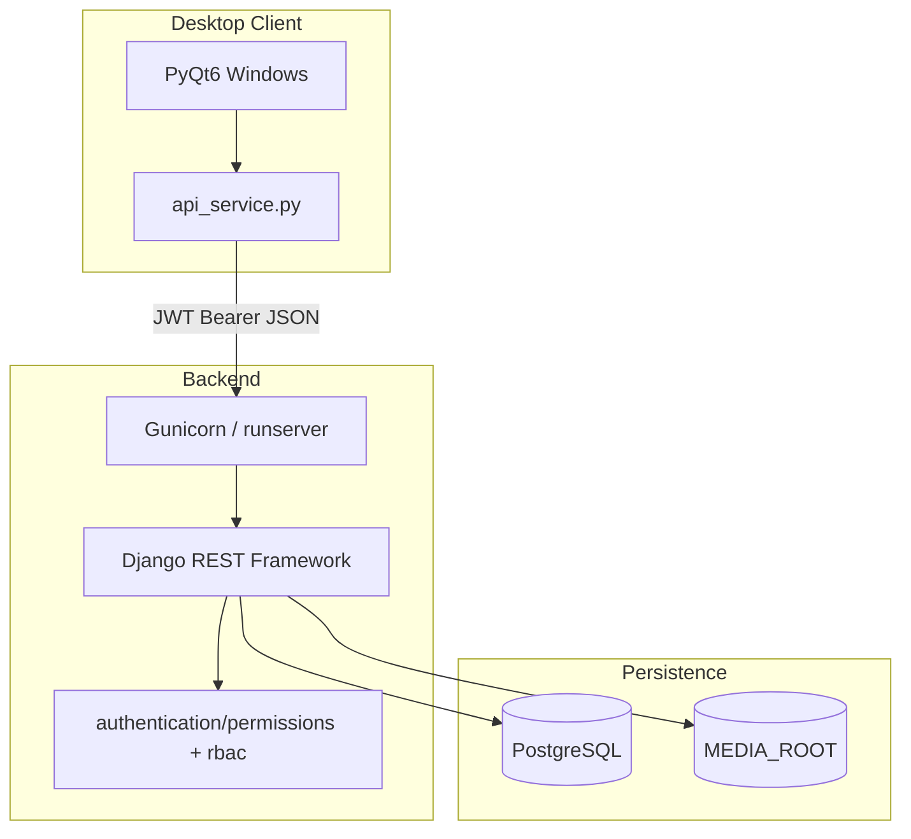
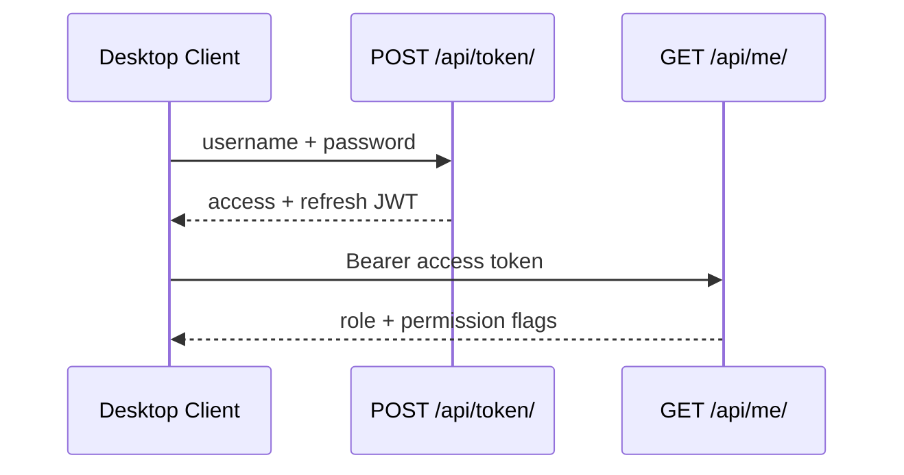

# Human Resource Management System (HRMS)

A full-stack Human Resource Management platform with a Django REST API backend, PostgreSQL database, and PyQt6 desktop client. It covers employee records, attendance, leave, projects, documents, payroll, onboarding, notifications, and role-based reporting.

---

## Overview

HRMS is designed for internal HR operations at small and medium organizations. The backend exposes a JSON REST API secured with JWT. The desktop client provides module-based screens for HR administrators, managers, and employees.

**Main capabilities:**

- Employee master data (departments, designations, education, bank details, emergency contacts)
- Attendance tracking with check-in/check-out and cycle-based reports
- Leave and permission (short time-off) workflows with manager approval
- Project allocation and headcount tracking
- Document upload and automated HR letter PDF generation
- Onboarding and resignation lifecycle management
- Salary records with payslip PDF export
- Dashboard analytics and exportable reports
- In-app notifications with scheduled generation


---

## Features

### Employees & organization

- Employee CRUD with department, designation, and manager hierarchy
- Education, bank details, ID proofs, and emergency contacts
- Employee directory and self-service profile updates
- Department and designation lookup management

### Attendance

- Daily attendance records (present, absent, half-day, leave)
- Check-in and check-out API actions with late-entry detection
- Cycle-based summaries and deviation reports (26th–25th payroll cycle)

### Leave & permissions

- Casual, sick, and earned leave types with annual balance tracking
- Manager/HR approval workflow
- Intra-day permission requests (time-range based)

### Projects

- Project portfolio with client and status tracking
- Employee allocations with release history and self-service role updates

### Documents

- Categorized file uploads with validation
- Generated letters: offer, appointment, experience, relieving, warning, promotion

### Lifecycle

- Onboarding checklist with document completion tracking
- Resignation and exit settlement tracking
- Joining letter PDF download

### Payroll

- Monthly salary records per employee and period
- Payslip PDF generation

### Dashboard & reports

- KPI cards, trend charts, and insight widgets
- Tabular reports for attendance, leave, projects, attrition, and payroll
- CSV and Excel export from the desktop client

### Platform

- JWT authentication with refresh tokens and login audit logging
- OpenAPI schema and Swagger UI
- Docker Compose deployment (PostgreSQL + Gunicorn)
- Health check endpoints for monitoring

---

## Technology Stack

### Backend

| Technology | Version | Purpose |
|------------|---------|---------|
| Python | 3.12 | Runtime |
| Django | 6.0.6 | Web framework |
| Django REST Framework | 3.17.1 | REST API |
| djangorestframework-simplejwt | 5.5.1 | JWT auth |
| drf-spectacular | 0.28.0 | OpenAPI / Swagger |
| django-cors-headers | 4.9.0 | CORS middleware |
| psycopg2-binary | 2.9.12 | PostgreSQL driver |
| python-dotenv | 1.2.2 | Environment loading |
| gunicorn | 23.0.0 | Production WSGI server |

### Frontend

| Technology | Version | Purpose |
|------------|---------|---------|
| PyQt6 | ≥6.6 | Desktop UI |
| requests | ≥2.31 | HTTP client |
| openpyxl | ≥3.1 | Excel export |
| python-dotenv | 1.2.2 | API URL configuration |

### Database

- **PostgreSQL 16** (Alpine image in Docker and CI)

### Deployment

- **Docker** + **Docker Compose** — backend and database containers
- **Gunicorn** — 3 workers, 120s timeout (configured in `docker-compose.yml`)

### Development tools

- GitHub Actions CI (`.github/workflows/ci.yml`)
- Django management commands for seeding, backup, and notifications
- `coverage` with 70% gate (`.coveragerc`)

---

## System Architecture

The application follows a client–server model. The PyQt6 desktop client communicates with the Django API over HTTP. PostgreSQL stores all persistent data. Uploaded and generated files are stored on disk under `MEDIA_ROOT`.



### Request flow

1. Desktop client sends HTTP request with `Authorization: Bearer <access_token>`.
2. DRF authenticates via `JWTAuthentication`.
3. Permission class checks role (HR / Manager / Employee).
4. `rbac.py` scopes the queryset to visible employees or projects.
5. Serializer validates input; view returns JSON response.

### Authentication flow



On `401`, the client attempts token refresh via `POST /api/token/refresh/`. Failed refresh triggers logout in the UI.

**RBAC summary:**

| Role | Data visibility |
|------|-----------------|
| HR | All employees and projects |
| Manager | Self + direct reports |
| Employee | Linked employee record only |

---

## Project Structure

Complete source tree (runtime directories `backend/media/`, `backend/logs/`, `frontend/logs/` are created at runtime and gitignored).

```
hrms-system/
├── README.md                              # Project documentation
├── requirements.txt                       # Backend Python dependencies
├── Dockerfile                             # Backend container image (Python 3.12-slim)
├── docker-compose.yml                     # PostgreSQL 16 + backend services
├── production.env.example                 # Production backend environment template
├── .env.example                           # Docker Compose DB variable template
├── .dockerignore                          # Docker build context exclusions
├── .gitignore                             # Ignores venv, .env, logs, media
├── .github/
│   └── workflows/
│       └── ci.yml                         # CI: backend tests, frontend compile, Docker build
├── scripts/
│   ├── backup_postgres.ps1                # Windows pg_dump backup script
│   ├── backup_postgres.sh                 # Linux/macOS pg_dump backup script
│   └── restore_postgres.ps1               # Windows pg_restore script
├── screenshots/
│   ├── api_documentation.png              # Swagger UI screenshot
│   ├── dashboard.png
│   ├── documents.png
│   ├── employee.png
│   ├── leave.png
│   ├── login_page.png
│   ├── notification.png
│   ├── payroll.png
│   └── project.png
├── backend/
│   ├── manage.py                          # Django CLI entry point
│   ├── hrms_test_utils.py                 # Shared API test helpers
│   ├── .env.example                       # Local/Docker backend environment template
│   ├── production.env.example             # Alternate production template
│   ├── .coveragerc                        # Coverage configuration (fail_under 70%)
│   ├── config/                            # Django project package
│   │   ├── __init__.py
│   │   ├── apps.py
│   │   ├── settings.py                    # Django, DRF, JWT, logging settings
│   │   ├── urls.py                        # Root URL configuration
│   │   ├── wsgi.py                        # Gunicorn WSGI entry
│   │   ├── asgi.py                        # ASGI entry
│   │   ├── env.py                         # Environment variable helpers
│   │   ├── startup.py                     # Startup validation checks
│   │   ├── health.py                      # Health check endpoints
│   │   ├── exceptions.py                  # DRF exception handler
│   │   ├── cycle.py                       # Payroll/attendance cycle (26th–25th)
│   │   ├── dates.py                       # Date parsing utilities
│   │   ├── management/
│   │   │   ├── __init__.py
│   │   │   └── commands/
│   │   │       ├── __init__.py
│   │   │       ├── seed_demo_data.py      # Minimal demo dataset
│   │   │       ├── seed_showcase_data.py  # Enterprise demo dataset (60 employees)
│   │   │       ├── backup_db.py           # PostgreSQL backup command
│   │   │       └── audit_permissions.py   # RBAC group audit command
│   │   ├── showcase/                      # Showcase seed data definitions
│   │   │   ├── __init__.py
│   │   │   ├── constants.py
│   │   │   ├── roster.py
│   │   │   └── seed.py
│   │   └── tests/
│   │       ├── __init__.py
│   │       ├── test_health.py
│   │       ├── test_settings.py
│   │       ├── test_backup_db.py
│   │       ├── test_smoke_rbac.py
│   │       └── test_gap_closure.py
│   ├── authentication/                    # JWT, UserProfile, AuditLog, RBAC
│   │   ├── __init__.py
│   │   ├── apps.py
│   │   ├── models.py
│   │   ├── admin.py
│   │   ├── views.py                       # /api/me/ endpoints
│   │   ├── urls.py
│   │   ├── serializers.py
│   │   ├── permissions.py                 # DRF permission classes
│   │   ├── rbac.py                        # Queryset scoping helpers
│   │   ├── groups.py                      # Django group sync
│   │   ├── signals.py
│   │   ├── audit.py
│   │   ├── token_views.py                 # POST /api/token/
│   │   ├── token_refresh.py               # POST /api/token/refresh/
│   │   ├── throttling.py
│   │   ├── tests.py
│   │   ├── tests_audit.py
│   │   ├── management/
│   │   │   ├── __init__.py
│   │   │   └── commands/
│   │   │       ├── __init__.py
│   │   │       └── sync_hrms_groups.py
│   │   └── migrations/
│   │       ├── __init__.py
│   │       ├── 0001_initial.py
│   │       └── 0002_production_hardening.py
│   ├── employees/
│   │   ├── __init__.py
│   │   ├── apps.py
│   │   ├── models.py
│   │   ├── admin.py
│   │   ├── views.py
│   │   ├── urls.py
│   │   ├── serializers.py
│   │   ├── tests.py
│   │   └── migrations/
│   │       ├── __init__.py
│   │       ├── 0001_initial.py
│   │       ├── 0002_bankdetails_education_emergencycontact.py
│   │       ├── 0003_employee_branch.py
│   │       ├── 0004_bankdetails_branch_education_university_and_more.py
│   │       └── 0005_production_hardening.py
│   ├── attendance/
│   │   ├── __init__.py
│   │   ├── apps.py
│   │   ├── models.py
│   │   ├── admin.py
│   │   ├── services.py                    # Working hours and late-entry rules
│   │   ├── views.py
│   │   ├── urls.py
│   │   ├── serializers.py
│   │   ├── tests.py
│   │   └── migrations/
│   │       ├── __init__.py
│   │       ├── 0001_initial.py
│   │       └── 0002_production_hardening.py
│   ├── leaves/
│   │   ├── __init__.py
│   │   ├── apps.py
│   │   ├── models.py                      # Leave and Permission models
│   │   ├── admin.py
│   │   ├── services.py                    # Leave balance calculations
│   │   ├── views.py
│   │   ├── urls.py
│   │   ├── serializers.py
│   │   ├── tests.py
│   │   └── migrations/
│   │       ├── __init__.py
│   │       ├── 0001_initial.py
│   │       ├── 0002_rename_applied_at_leave_created_at_leave_updated_at_and_more.py
│   │       ├── 0003_permission.py
│   │       └── 0004_production_hardening.py
│   ├── projects/
│   │   ├── __init__.py
│   │   ├── apps.py
│   │   ├── models.py
│   │   ├── admin.py
│   │   ├── views.py
│   │   ├── urls.py
│   │   ├── serializers.py
│   │   ├── tests.py
│   │   └── migrations/
│   │       ├── __init__.py
│   │       ├── 0001_initial.py
│   │       ├── 0002_production_hardening.py
│   │       └── 0003_allocation_details.py
│   ├── documents/
│   │   ├── __init__.py
│   │   ├── apps.py
│   │   ├── models.py
│   │   ├── admin.py
│   │   ├── validators.py
│   │   ├── pdf_utils.py                   # Custom PDF builder
│   │   ├── letter_service.py              # HR letter generation
│   │   ├── views.py
│   │   ├── urls.py
│   │   ├── serializers.py
│   │   ├── tests.py
│   │   ├── test_validators.py
│   │   └── migrations/
│   │       ├── __init__.py
│   │       ├── 0001_initial.py
│   │       ├── 0002_seed_categories.py
│   │       └── 0003_production_hardening.py
│   ├── lifecycle/
│   │   ├── __init__.py
│   │   ├── apps.py
│   │   ├── models.py
│   │   ├── admin.py
│   │   ├── onboarding_checklist.py
│   │   ├── joining_letter.py
│   │   ├── views.py
│   │   ├── urls.py
│   │   ├── serializers.py
│   │   ├── tests.py
│   │   └── migrations/
│   │       ├── __init__.py
│   │       └── 0001_initial.py
│   ├── notifications/
│   │   ├── __init__.py
│   │   ├── apps.py
│   │   ├── models.py
│   │   ├── admin.py
│   │   ├── services.py
│   │   ├── scheduler.py
│   │   ├── views.py
│   │   ├── urls.py
│   │   ├── serializers.py
│   │   ├── tests.py
│   │   ├── management/
│   │   │   ├── __init__.py
│   │   │   └── commands/
│   │   │       ├── __init__.py
│   │   │       └── generate_notifications.py
│   │   └── migrations/
│   │       ├── __init__.py
│   │       ├── 0001_initial.py
│   │       └── 0002_permission_notification_types.py
│   ├── payroll/
│   │   ├── __init__.py
│   │   ├── apps.py
│   │   ├── models.py
│   │   ├── admin.py
│   │   ├── payslip_pdf.py
│   │   ├── views.py
│   │   ├── urls.py
│   │   ├── serializers.py
│   │   ├── tests.py
│   │   └── migrations/
│   │       ├── __init__.py
│   │       ├── 0001_initial.py
│   │       └── 0002_production_hardening.py
│   └── dashboard/
│       ├── __init__.py
│       ├── apps.py
│       ├── models.py                      # Placeholder (no DB models)
│       ├── admin.py
│       ├── insights.py
│       ├── views.py                       # Stats, analytics, reports
│       ├── urls.py
│       └── tests.py
└── frontend/                              # PyQt6 desktop client (not containerized)
    ├── main.py                            # Application entry point
    ├── requirements.txt
    ├── .env.example
    ├── styles.qss                         # Qt stylesheet (unused)
    ├── api_service.py                     # REST API client
    ├── log_config.py                      # Client logging
    ├── ui_helpers.py                      # Loading cursor and error dialogs
    ├── table_utils.py                     # Paginated tables and export hooks
    ├── exporters.py                       # CSV and Excel export
    ├── bar_chart.py                       # Dashboard chart widget
    ├── document_letter_types.py
    ├── login_window.py
    ├── dashboard.py                       # Main shell and sidebar navigation
    ├── employee_window.py
    ├── employee_form.py
    ├── employee_profile_dialog.py
    ├── department_window.py
    ├── designation_window.py
    ├── lookup_form.py
    ├── attendance_window.py
    ├── attendance_form.py
    ├── attendance_deviation_window.py
    ├── leave_window.py
    ├── leave_form.py
    ├── permission_window.py
    ├── permission_form.py
    ├── project_window.py
    ├── project_form.py
    ├── allocate_form.py
    ├── project_self_form.py
    ├── document_window.py
    ├── document_form.py
    ├── document_generate_form.py
    ├── lifecycle_window.py
    ├── onboarding_form.py
    ├── resignation_form.py
    ├── onboarding_checklist_dialog.py
    ├── directory_window.py
    ├── self_service_window.py
    ├── report_window.py
    ├── payroll_window.py
    ├── payroll_form.py
    └── notification_window.py
```

---

## Prerequisites

| Requirement | Version / notes |
|-------------|-----------------|
| Python | 3.12 |
| PostgreSQL | 16 recommended (15+ supported) |
| pip | Latest recommended |
| Git | For cloning the repository |
| Docker & Docker Compose | Optional, for containerized setup |
| PostgreSQL client tools | Optional, for `pg_dump` / `pg_restore` backups |

**Desktop client:** A graphical environment capable of running PyQt6 (Windows, macOS, or Linux desktop).

---

## System Requirements

| Component | Minimum | Recommended |
|-----------|---------|-------------|
| Backend server | 2 CPU, 4 GB RAM | 4 CPU, 8 GB RAM |
| PostgreSQL storage | 1 GB | 50+ GB (with media growth) |
| Desktop workstation | 4 GB RAM | 8 GB RAM, 1920×1080 display |

---

## Installation

### Windows

```powershell
git clone <repository-url> hrms-system
cd hrms-system\backend

python -m venv venv
.\venv\Scripts\activate
pip install -r ..\requirements.txt

copy .env.example .env
# Edit .env — set DB_PASSWORD and connection details

python manage.py migrate
python manage.py seed_demo_data
python manage.py runserver
```

```powershell
cd ..\frontend
python -m venv venv
.\venv\Scripts\activate
pip install -r requirements.txt
copy .env.example .env
python main.py
```

### Linux

```bash
git clone <repository-url> hrms-system
cd hrms-system/backend

python3.12 -m venv venv
source venv/bin/activate
pip install -r ../requirements.txt

cp .env.example .env
python manage.py migrate
python manage.py seed_demo_data
python manage.py runserver 0.0.0.0:8000
```

```bash
cd ../frontend
python3.12 -m venv venv
source venv/bin/activate
pip install -r requirements.txt
cp .env.example .env
python main.py
```

### PostgreSQL setup

```sql
CREATE USER hrms_app WITH PASSWORD 'your_password';
CREATE DATABASE hrms_db OWNER hrms_app;
GRANT ALL PRIVILEGES ON DATABASE hrms_db TO hrms_app;
```

Set credentials in `backend/.env`:

```env
DB_NAME=hrms_db
DB_USER=hrms_app
DB_PASSWORD=your_password
DB_HOST=localhost
DB_PORT=5432
```

### Docker setup

```powershell
copy .env.example .env
copy backend\.env.example backend\.env
# Ensure DB_PASSWORD matches in both files

docker compose up --build -d
docker compose ps
```

The backend container runs migrations, collects static files, and starts Gunicorn automatically.

### Environment variable configuration

| File | Purpose |
|------|---------|
| `.env.example` → `.env` | Docker Compose `DB_*` substitution |
| `backend/.env.example` → `backend/.env` | Backend application settings |
| `frontend/.env.example` → `frontend/.env` | Desktop client API URL |
| `production.env.example` → `backend/.env` | Production template |

---

## Configuration

### Core environment variables (`backend/.env`)

| Variable | Default | Description |
|----------|---------|-------------|
| `SECRET_KEY` | Dev fallback in code | Django secret key — **required in production** |
| `DEBUG` | `True` | Set `False` for production |
| `ALLOWED_HOSTS` | `127.0.0.1,localhost` | Comma-separated hostnames |
| `DB_NAME` | `hrms_db` | PostgreSQL database name |
| `DB_USER` | `postgres` | Database user |
| `DB_PASSWORD` | — | Database password |
| `DB_HOST` | `localhost` | Use `db` inside Docker Compose |
| `DB_PORT` | `5432` | Database port |
| `TIME_ZONE` | `Asia/Kolkata` | Application timezone |
| `JWT_ACCESS_MINUTES` | `60` | Access token lifetime |
| `JWT_REFRESH_DAYS` | `1` | Refresh token lifetime |
| `HRMS_MAX_UPLOAD_BYTES` | `5242880` | Max upload size (5 MB) |
| `LOG_DIR` | `logs` | Backend log directory |
| `MEDIA_ROOT` | `media` | Uploaded file storage |
| `STATIC_ROOT` | `staticfiles` | Collected static files |

### Production settings

When `DEBUG=False`, `settings.py` enforces:

- All `DB_*` variables must be set
- `SECRET_KEY` must not use the dev default
- `ALLOWED_HOSTS` must be non-empty (no `*`)
- `CORS_ALLOW_ALL_ORIGINS` must be `False`
- `CORS_ALLOWED_ORIGINS` must be set (for browser clients)

Copy `production.env.example` as a starting point.

### Frontend configuration

| Variable | Default | Description |
|----------|---------|-------------|
| `HRMS_API_URL` | `http://127.0.0.1:8000/api` | API base URL including `/api` |

### Static and media

- **Development:** Media files served by Django when `DEBUG=True`.
- **Production:** Run `python manage.py collectstatic --noinput`. Serve media via reverse proxy or persistent volume (`media_data` in Docker).

---

## Running the System

### Backend — development server

```powershell
cd backend
.\venv\Scripts\activate
python manage.py runserver
# Listen on all interfaces:
python manage.py runserver 0.0.0.0:8000
```

### Backend — production server

```bash
gunicorn config.wsgi:application --bind 0.0.0.0:8000 --workers 3 --timeout 120
```

### Frontend application

```powershell
cd frontend
.\venv\Scripts\activate
python main.py
```

### Docker commands

| Command | Description |
|---------|-------------|
| `docker compose up -d` | Start services |
| `docker compose logs -f backend` | View backend logs |
| `docker compose exec backend python manage.py migrate` | Run migrations |
| `docker compose exec backend python manage.py shell` | Django shell |
| `docker compose down` | Stop services |
| `docker compose down -v` | Stop and remove volumes |

### Management commands

| Command | Description |
|---------|-------------|
| `python manage.py seed_demo_data` | Create minimal demo users and employees |
| `python manage.py seed_showcase_data` | Create 60-employee showcase dataset |
| `python manage.py generate_notifications` | Generate daily notifications |
| `python manage.py backup_db` | Backup database to `backend/backups/` |
| `python manage.py audit_permissions` | Audit RBAC group membership |
| `python manage.py sync_hrms_groups` | Sync Django groups from profiles |

---

## Quick Start

Fastest path to a running local system:

```powershell
# 1. Clone and configure backend
git clone <repository-url> hrms-system
cd hrms-system\backend
python -m venv venv && .\venv\Scripts\activate
pip install -r ..\requirements.txt
copy .env.example .env
# Set DB_PASSWORD; ensure PostgreSQL is running with database hrms_db

# 2. Initialize database
python manage.py migrate
python manage.py seed_demo_data

# 3. Start API
python manage.py runserver
```

```powershell
# 4. Start desktop client (new terminal)
cd hrms-system\frontend
python -m venv venv && .\venv\Scripts\activate
pip install -r requirements.txt
python main.py
```

The `seed_demo_data` command prints login usernames to the terminal. API docs are available at `http://127.0.0.1:8000/api/docs/`.

**Docker quick start:**

```powershell
copy .env.example .env
copy backend\.env.example backend\.env
docker compose up --build -d
```

---

## Usage

### Login

1. Launch `python main.py` from the `frontend/` directory.
2. Enter credentials; the client calls `POST /api/token/`.
3. On success, `GET /api/me/` loads role and permission flags.
4. The dashboard sidebar shows modules allowed for your role.

### Employee management

HR users access **Employees**, **Departments**, and **Designations** from the sidebar. Create and edit records through form dialogs. Open the profile dialog to manage education, bank details, ID proofs, and emergency contacts.

### Attendance management

Managers and HR use **Attendance** to view and edit records. Employees can check in/out via the API (self-service or attendance screen). Cycle reports are available under **Reports**.

### Leave management

**Leaves** supports creating requests, viewing balances, and approving/rejecting (Manager/HR). **Permissions** handles short intra-day time-off requests with the same approval flow.

### Payroll management

HR and managers access **Payroll** to create monthly `SalaryRecord` entries and download payslip PDFs. Period labels follow the 26th–25th cycle calendar.

### Document generation

HR users open **Documents** to upload files or generate HR letters (offer, appointment, experience, relieving, warning, promotion). Generated PDFs are stored under `MEDIA_ROOT/employee_documents/`.

### Notifications

The **Notifications** screen lists in-app alerts. Run `python manage.py generate_notifications` daily (or via cron) for birthday, anniversary, and pending-approval alerts.

### Reports

**Reports** provides tabular data for attendance, leave, project headcount, attrition, and payroll. Export to CSV or Excel from the table toolbar.

---

## API Documentation

| Item | Value |
|------|-------|
| **Base URL** | `http://<host>:8000/api/` |
| **Authentication** | JWT Bearer token (`Authorization: Bearer <access>`) |
| **Token endpoint** | `POST /api/token/` |
| **Refresh endpoint** | `POST /api/token/refresh/` |
| **OpenAPI schema** | `GET /api/schema/` |
| **Swagger UI** | `GET /api/docs/` |

### Major API groups

| Group | Prefix | Access |
|-------|--------|--------|
| Health | `/api/health/`, `/api/health/ready/` | Public |
| Auth profile | `/api/me/`, `/api/me/profile/` | Authenticated |
| Employees | `/api/employees/`, `/api/departments/`, `/api/designations/`, nested records | Read: all roles; Write: HR |
| Attendance | `/api/attendance/` + check-in, check-out, summary, report | HR/Manager write; self check-in |
| Leaves | `/api/leaves/`, `/api/permissions/` + approve/reject | Authenticated; approve: Manager/HR |
| Projects | `/api/projects/`, `/api/allocations/` | HR write; scoped read |
| Documents | `/api/documents/`, `/api/document-categories/` | HR write |
| Lifecycle | `/api/onboardings/`, `/api/resignations/` | HR write |
| Payroll | `/api/salaries/` + payslip download | HR write |
| Notifications | `/api/notifications/` | Authenticated |
| Dashboard | `/api/dashboard/stats/`, `/analytics/`, `/insights/` | Authenticated |
| Reports | `/api/reports/attendance/`, `/leave/`, etc. | Authenticated |

Standard ViewSet operations (`GET`, `POST`, `PUT`, `PATCH`, `DELETE`) apply unless noted. Interactive documentation is available at `/api/docs/`.

---

## Deployment

1. Copy `production.env.example` to `backend/.env` and set `DEBUG=False`, secrets, and `ALLOWED_HOSTS`.
2. Provision PostgreSQL and configure `DB_*` variables.
3. Install dependencies: `pip install -r requirements.txt`
4. Run migrations: `python manage.py migrate`
5. Collect static files: `python manage.py collectstatic --noinput`
6. Start Gunicorn (or `docker compose up -d`).
7. Distribute the desktop client with `HRMS_API_URL` pointing to the API host.

**Reverse proxy:** Terminate TLS at nginx or similar; proxy to `http://127.0.0.1:8000`. Set `USE_SECURE_PROXY_SSL_HEADER=True` in production `.env`.

**Health check:** `GET /api/health/ready/` returns database connectivity status (`503` if DB is unreachable).

**Migrations:**

```bash
python manage.py migrate --noinput
```

---

## Troubleshooting

### Docker

| Issue | Solution |
|-------|----------|
| Backend container exits on start | Check `docker compose logs backend` — usually DB credentials |
| Database container unhealthy | Align `DB_PASSWORD` in root `.env` and `backend/.env` |
| Port 8000 already in use | Stop conflicting process or change port mapping |

### Database

| Issue | Solution |
|-------|----------|
| `connection refused` | Ensure PostgreSQL is running; verify `DB_HOST` and `DB_PORT` |
| `password authentication failed` | Match `DB_PASSWORD` with PostgreSQL user password |
| `database does not exist` | Create database: `CREATE DATABASE hrms_db;` |

### Authentication

| Issue | Solution |
|-------|----------|
| `401` on all requests | Re-login; check token expiry (`JWT_ACCESS_MINUTES`) |
| Login rate limited | Wait and retry (`HRMS_LOGIN_THROTTLE=20/minute`) |
| Session expired immediately | Ensure `SECRET_KEY` is stable across server restarts |

### Frontend

| Issue | Solution |
|-------|----------|
| `ModuleNotFoundError: PyQt6` | `pip install -r frontend/requirements.txt` |
| Cannot connect to API | Verify backend is running; check `HRMS_API_URL` in `frontend/.env` |
| Application crash | Inspect `frontend/logs/hrms-client-error.log` |

---

## Common Issues

| Error | Cause | Solution |
|-------|-------|----------|
| `ImproperlyConfigured: Production requires 'DB_PASSWORD'` | `DEBUG=False` without DB config | Set all `DB_*` variables |
| `CORS_ALLOW_ALL_ORIGINS must be false` | Production CORS misconfiguration | Set `CORS_ALLOW_ALL_ORIGINS=False` and `CORS_ALLOWED_ORIGINS` |
| `pg_dump not found` | PostgreSQL client tools missing | Install client tools or use host backup scripts |
| `Network error` in desktop client | Backend unreachable | Start API server; verify `HRMS_API_URL` |
| Migration conflicts | Schema drift | `python manage.py showmigrations`; restore from backup if needed |

---

## Performance Tips

- Set `DB_CONN_MAX_AGE=60` to reuse database connections (default in `.env.example`).
- Scale Gunicorn workers with CPU cores (default: 3 in Docker Compose).
- Use indexed filters (`employee`, `date`, `status`) when querying large datasets.
- Schedule `generate_notifications` off-peak to avoid API contention.
- Store `media/` on fast persistent storage in production.

---

## Contributing

1. Fork the repository and create a feature branch.
2. Set up a local environment following the Installation section.
3. Run tests before submitting changes:

```bash
cd backend
python manage.py check
python manage.py makemigrations --check
python manage.py test
python -m compileall ../frontend -x "/venv/"
```

4. Follow existing code conventions and keep changes focused.
5. Do not commit `.env` files, secrets, or generated media/logs.
6. Open a pull request with a clear description of the change.

---

## License

This project does not include a license file. All rights reserved unless a `LICENSE` file is added by the repository owner.

