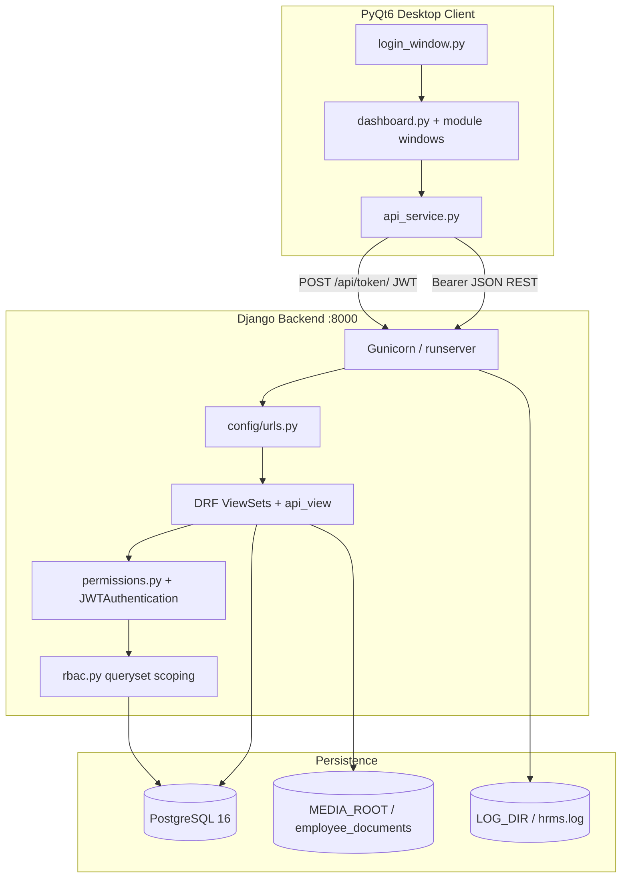
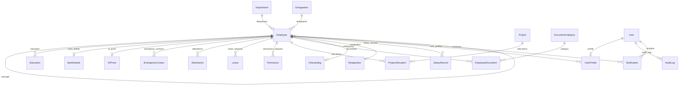

# Human Resource Management System (HRMS)


Human Resource Management System (HRMS) featuring employee management, attendance, leave workflows, payroll, document generation, onboarding, notifications, reports, and role-based access control. Built with Django, Django REST Framework, PostgreSQL, PyQt6, JWT Authentication, and Docker.

---

## 🗂️ Overview and Features

### What the system is

| Layer | Technology | Location |
|-------|------------|----------|
| API server | Django 6.0.6 + DRF + JWT | `backend/` |
| Database | PostgreSQL 16 | External or Docker `db` service |
| Desktop UI | PyQt6 | `frontend/` (runs on user workstations, not in Docker) |

### Feature modules

| Module | Backend app | Capabilities |
|--------|-------------|--------------|
| Employees | `employees` | CRUD, department/designation lookups, education, bank details, ID proofs, emergency contacts |
| Attendance | `attendance` | Daily records, check-in/out, late detection (shift 09:30 + 10 min grace), cycle summary/report/history |
| Leave | `leaves` | CL/SL/EL requests, balance (12/12/15 per year), manager/HR approve-reject |
| Permissions | `leaves` | Intra-day time-off requests with same approval flow |
| Projects | `projects` | Portfolio, allocations, release, headcount, employee self-update on active allocation |
| Documents | `documents` | Uploads (max 5 MB), six HR letter PDF types |
| Lifecycle | `lifecycle` | Onboarding checklist, resignation tracking, joining letter PDF |
| Payroll | `payroll` | Monthly `SalaryRecord` (`YYYY-MM` period), payslip PDF |
| Notifications | `notifications` | In-app alerts; birthday, anniversary, pending-approval generation |
| Dashboard & reports | `dashboard` | KPI stats, analytics, insights, five exportable report endpoints (no ORM models) |
| Auth & audit | `authentication` | JWT login, `/api/me/` permission flags, `AuditLog` |

---

## 🏗️ System Architecture



### Request flow (authenticated API call)

1. `api_service.py` attaches `Authorization: Bearer <access>` from login (`POST /api/token/`).
2. `JWTAuthentication` validates the token (`JWT_ACCESS_MINUTES`, default 60).
3. DRF permission class checks group membership (`IsHROrReadOnly`, `IsManagerOrHR`, etc.).
4. ViewSet calls `rbac.filter_*_for_user()` — HR sees all records; Manager sees self + direct reports; Employee sees linked employee only.
5. Serializer validates input; JSON response returned. On `401`, client attempts `POST /api/token/refresh/`; failure triggers logout.

### Login flow (desktop)

1. `main.py` → `LoginWindow` → `APIService.login(username, password)`.
2. `POST /api/token/` → stores access + refresh tokens; writes `login_success` / `login_failed` to `AuditLog`.
3. `GET /api/me/` → loads `role` and `permissions` map; sidebar items filtered in `dashboard.py`.
4. `Dashboard` hosts 15 modules in a `QStackedWidget` (no separate top-level windows per module).

---

## 🛠️ Tech Stack

### Backend (`requirements.txt`)

| Package | Version |
|---------|---------|
| Python | 3.12 |
| Django | 6.0.6 |
| djangorestframework | 3.17.1 |
| djangorestframework-simplejwt | 5.5.1 |
| drf-spectacular | 0.28.0 |
| django-cors-headers | 4.9.0 |
| psycopg2-binary | 2.9.12 |
| python-dotenv | 1.2.2 |
| gunicorn | 23.0.0 |

### Frontend (`frontend/requirements.txt`)

| Package | Version |
|---------|---------|
| PyQt6 | ≥6.6.0, <7 |
| requests | ≥2.31.0, <3 |
| openpyxl | ≥3.1.0, <4 |
| python-dotenv | 1.2.2 |

### Infrastructure

| Component | Detail |
|-----------|--------|
| Database | PostgreSQL 16 (`postgres:16-alpine` in Docker and CI) |
| WSGI | Gunicorn — 3 workers, 120 s timeout (`Dockerfile`, `docker-compose.yml`) |
| CI | GitHub Actions — `.github/workflows/ci.yml` |
| API docs | OpenAPI via drf-spectacular — `/api/schema/`, `/api/docs/` |

---

## 🗄️ Database Design — ER Diagram

PostgreSQL only (`django.db.backends.postgresql`). **18 models** across 9 apps; `dashboard` has no models.

No standalone ER diagram image exists in the repository. Relationship diagram:



### 🗄️ Model inventory

| Model | App | Key fields / constraints |
|-------|-----|--------------------------|
| `Department` | employees | `name` |
| `Designation` | employees | `title` |
| `Employee` | employees | `employee_code` (unique), `email` (unique), `status` ACTIVE/INACTIVE/RESIGNED, self-FK `manager` |
| `Education` | employees | FK → Employee |
| `BankDetails` | employees | OneToOne → Employee |
| `IDProof` | employees | OneToOne → Employee |
| `EmergencyContact` | employees | FK → Employee |
| `Attendance` | attendance | `date`, `check_in`, `check_out`, `working_hours`, `late_entry`, `status` PRESENT/ABSENT/HALF_DAY/LEAVE |
| `Leave` | leaves | `leave_type` CL/SL/EL, `status` PENDING/APPROVED/REJECTED, FK `approved_by` → Employee |
| `Permission` | leaves | `date`, `from_time`, `to_time`, approval workflow |
| `Project` | projects | `status` ACTIVE/COMPLETED |
| `ProjectAllocation` | projects | `allocated_on`, `released_on` (null = active), `role`, `responsibilities`, `notes` |
| `DocumentCategory` | documents | `name` (unique); seeded: Offer Letters, Appointment Letters, HR Documents |
| `EmployeeDocument` | documents | `file` → `employee_documents/` |
| `Onboarding` | lifecycle | OneToOne → Employee; checklist booleans + `status` |
| `Resignation` | lifecycle | OneToOne → Employee; `notice_period_days` default 30 |
| `SalaryRecord` | payroll | `period` YYYY-MM, unique (`employee`, `period`); `net_salary` property |
| `UserProfile` | authentication | `role` HR/MANAGER/EMPLOYEE; FK → Employee |
| `AuditLog` | authentication | `action`, `changes` JSON, immutable |
| `Notification` | notifications | `recipient` null = broadcast; types include BIRTHDAY, ANNIVERSARY, PENDING_APPROVAL |

---

## 📁 Project Structure

Source-controlled files (242 files). Runtime directories created at use and gitignored: `backend/media/`, `backend/logs/`, `backend/backups/`, `frontend/logs/`, `backend/staticfiles/`, virtualenvs.

```
hrms-system/
├── .dockerignore
├── .env.example
├── .github/
│   └── workflows/
│       └── ci.yml
├── .gitignore
├── Dockerfile
├── backend/
│   ├── .coveragerc
│   ├── .env.example
│   ├── attendance/
│   │   ├── __init__.py
│   │   ├── admin.py
│   │   ├── apps.py
│   │   ├── migrations/
│   │   │   ├── 0001_initial.py
│   │   │   ├── 0002_production_hardening.py
│   │   │   └── __init__.py
│   │   ├── models.py
│   │   ├── serializers.py
│   │   ├── services.py
│   │   ├── tests.py
│   │   ├── urls.py
│   │   └── views.py
│   ├── authentication/
│   │   ├── __init__.py
│   │   ├── admin.py
│   │   ├── apps.py
│   │   ├── audit.py
│   │   ├── groups.py
│   │   ├── management/
│   │   │   ├── __init__.py
│   │   │   └── commands/
│   │   │       ├── __init__.py
│   │   │       └── sync_hrms_groups.py
│   │   ├── migrations/
│   │   │   ├── 0001_initial.py
│   │   │   ├── 0002_production_hardening.py
│   │   │   └── __init__.py
│   │   ├── models.py
│   │   ├── permissions.py
│   │   ├── rbac.py
│   │   ├── serializers.py
│   │   ├── signals.py
│   │   ├── tests.py
│   │   ├── tests_audit.py
│   │   ├── throttling.py
│   │   ├── token_refresh.py
│   │   ├── token_views.py
│   │   ├── urls.py
│   │   └── views.py
│   ├── config/
│   │   ├── __init__.py
│   │   ├── apps.py
│   │   ├── asgi.py
│   │   ├── cycle.py
│   │   ├── dates.py
│   │   ├── env.py
│   │   ├── exceptions.py
│   │   ├── health.py
│   │   ├── management/
│   │   │   ├── __init__.py
│   │   │   └── commands/
│   │   │       ├── __init__.py
│   │   │       ├── audit_permissions.py
│   │   │       ├── backup_db.py
│   │   │       ├── seed_demo_data.py
│   │   │       └── seed_showcase_data.py
│   │   ├── settings.py
│   │   ├── showcase/
│   │   │   ├── __init__.py
│   │   │   ├── constants.py
│   │   │   ├── roster.py
│   │   │   └── seed.py
│   │   ├── startup.py
│   │   ├── tests/
│   │   │   ├── __init__.py
│   │   │   ├── test_backup_db.py
│   │   │   ├── test_gap_closure.py
│   │   │   ├── test_health.py
│   │   │   ├── test_settings.py
│   │   │   └── test_smoke_rbac.py
│   │   ├── urls.py
│   │   └── wsgi.py
│   ├── dashboard/
│   │   ├── __init__.py
│   │   ├── admin.py
│   │   ├── apps.py
│   │   ├── insights.py
│   │   ├── migrations/
│   │   │   └── __init__.py
│   │   ├── models.py
│   │   ├── tests.py
│   │   ├── urls.py
│   │   └── views.py
│   ├── documents/
│   │   ├── __init__.py
│   │   ├── admin.py
│   │   ├── apps.py
│   │   ├── letter_service.py
│   │   ├── migrations/
│   │   │   ├── 0001_initial.py
│   │   │   ├── 0002_seed_categories.py
│   │   │   ├── 0003_production_hardening.py
│   │   │   └── __init__.py
│   │   ├── models.py
│   │   ├── pdf_utils.py
│   │   ├── serializers.py
│   │   ├── test_validators.py
│   │   ├── tests.py
│   │   ├── urls.py
│   │   ├── validators.py
│   │   └── views.py
│   ├── employees/
│   │   ├── __init__.py
│   │   ├── admin.py
│   │   ├── apps.py
│   │   ├── migrations/
│   │   │   ├── 0001_initial.py
│   │   │   ├── 0002_bankdetails_education_emergencycontact.py
│   │   │   ├── 0003_employee_branch.py
│   │   │   ├── 0004_bankdetails_branch_education_university_and_more.py
│   │   │   ├── 0005_production_hardening.py
│   │   │   └── __init__.py
│   │   ├── models.py
│   │   ├── serializers.py
│   │   ├── tests.py
│   │   ├── urls.py
│   │   └── views.py
│   ├── hrms_test_utils.py
│   ├── leaves/
│   │   ├── __init__.py
│   │   ├── admin.py
│   │   ├── apps.py
│   │   ├── migrations/
│   │   │   ├── 0001_initial.py
│   │   │   ├── 0002_rename_applied_at_leave_created_at_leave_updated_at_and_more.py
│   │   │   ├── 0003_permission.py
│   │   │   ├── 0004_production_hardening.py
│   │   │   └── __init__.py
│   │   ├── models.py
│   │   ├── serializers.py
│   │   ├── services.py
│   │   ├── tests.py
│   │   ├── urls.py
│   │   └── views.py
│   ├── lifecycle/
│   │   ├── __init__.py
│   │   ├── admin.py
│   │   ├── apps.py
│   │   ├── joining_letter.py
│   │   ├── migrations/
│   │   │   ├── 0001_initial.py
│   │   │   └── __init__.py
│   │   ├── models.py
│   │   ├── onboarding_checklist.py
│   │   ├── serializers.py
│   │   ├── tests.py
│   │   ├── urls.py
│   │   └── views.py
│   ├── manage.py
│   ├── notifications/
│   │   ├── __init__.py
│   │   ├── admin.py
│   │   ├── apps.py
│   │   ├── management/
│   │   │   ├── __init__.py
│   │   │   └── commands/
│   │   │       ├── __init__.py
│   │   │       └── generate_notifications.py
│   │   ├── migrations/
│   │   │   ├── 0001_initial.py
│   │   │   ├── 0002_permission_notification_types.py
│   │   │   └── __init__.py
│   │   ├── models.py
│   │   ├── scheduler.py
│   │   ├── serializers.py
│   │   ├── services.py
│   │   ├── tests.py
│   │   ├── urls.py
│   │   └── views.py
│   ├── payroll/
│   │   ├── __init__.py
│   │   ├── admin.py
│   │   ├── apps.py
│   │   ├── migrations/
│   │   │   ├── 0001_initial.py
│   │   │   ├── 0002_production_hardening.py
│   │   │   └── __init__.py
│   │   ├── models.py
│   │   ├── payslip_pdf.py
│   │   ├── serializers.py
│   │   ├── tests.py
│   │   ├── urls.py
│   │   └── views.py
│   ├── production.env.example
│   └── projects/
│       ├── __init__.py
│       ├── admin.py
│       ├── apps.py
│       ├── migrations/
│       │   ├── 0001_initial.py
│       │   ├── 0002_production_hardening.py
│       │   ├── 0003_allocation_details.py
│       │   └── __init__.py
│       ├── models.py
│       ├── serializers.py
│       ├── tests.py
│       ├── urls.py
│       └── views.py
├── docker-compose.yml
├── docs/
│   ├── API_REFERENCE.md
│   ├── ARCHITECTURE.md
│   ├── DEPLOYMENT.md
│   ├── MAINTENANCE.md
│   ├── SCHEDULER.md
│   └── SECURITY.md
├── frontend/
│   ├── .env.example
│   ├── allocate_form.py
│   ├── api_service.py
│   ├── attendance_deviation_window.py
│   ├── attendance_form.py
│   ├── attendance_window.py
│   ├── bar_chart.py
│   ├── dashboard.py
│   ├── department_window.py
│   ├── designation_window.py
│   ├── directory_window.py
│   ├── document_form.py
│   ├── document_generate_form.py
│   ├── document_letter_types.py
│   ├── document_window.py
│   ├── employee_form.py
│   ├── employee_profile_dialog.py
│   ├── employee_window.py
│   ├── exporters.py
│   ├── leave_form.py
│   ├── leave_window.py
│   ├── lifecycle_window.py
│   ├── log_config.py
│   ├── login_window.py
│   ├── lookup_form.py
│   ├── main.py
│   ├── notification_window.py
│   ├── onboarding_checklist_dialog.py
│   ├── onboarding_form.py
│   ├── payroll_form.py
│   ├── payroll_window.py
│   ├── permission_form.py
│   ├── permission_window.py
│   ├── project_form.py
│   ├── project_self_form.py
│   ├── project_window.py
│   ├── report_window.py
│   ├── requirements.txt
│   ├── resignation_form.py
│   ├── self_service_window.py
│   ├── styles.qss
│   ├── table_utils.py
│   └── ui_helpers.py
├── production.env.example
├── requirements.txt
├── screenshots/
│   ├── api_documentation.png
│   ├── dashboard.png
│   ├── documents.png
│   ├── employee.png
│   ├── leave.png
│   ├── login_page.png
│   ├── notification.png
│   ├── payroll.png
│   └── project.png
└── scripts/
    ├── backup_postgres.ps1
    ├── backup_postgres.sh
    └── restore_postgres.ps1
```

`frontend/styles.qss` exists but is empty and not loaded by `dashboard.py` (inline stylesheet used).

---

## ✅ System Requirements and Prerequisites

### Prerequisites

| Requirement | Version / notes |
|-------------|-----------------|
| Python | 3.12 |
| PostgreSQL | 16 (15+ works) |
| pip | Current |
| Git | Any recent |
| Docker & Docker Compose | Optional (backend + DB only) |
| PostgreSQL client tools | Optional (`pg_dump` / `pg_restore` for backups) |
| Graphical desktop | Required for PyQt6 client |

---

## ⚙️ Environment Setup

Copy templates before first run. Never commit real `.env` files (gitignored).

### ⚙️ Template files

| Copy from | Copy to | Purpose |
|-----------|---------|---------|
| `.env.example` | `.env` | Docker Compose `DB_*` substitution |
| `backend/.env.example` | `backend/.env` | Django settings |
| `frontend/.env.example` | `frontend/.env` | Desktop API URL |
| `production.env.example` | `backend/.env` | Production (Docker-oriented) |
| `backend/production.env.example` | `backend/.env` | Production (bare-metal paths) |

### ⚙️ Root `.env` (Docker Compose)

```env
DB_NAME=hrms_db
DB_USER=postgres
DB_PASSWORD=postgres
```

### ⚙️ Backend `backend/.env` (development)

```env
SECRET_KEY=change-me-to-a-long-random-string
DEBUG=True
ALLOWED_HOSTS=127.0.0.1,localhost

DB_NAME=hrms_db
DB_USER=postgres
DB_PASSWORD=your_password_here
DB_HOST=localhost
DB_PORT=5432
DB_CONN_MAX_AGE=60
DB_CONN_HEALTH_CHECKS=True
DB_CONNECT_TIMEOUT=10
```

### ⚙️ Frontend `frontend/.env`

```env
HRMS_API_URL=http://127.0.0.1:8000/api
```

### ⚙️ Production `production.env.example` (repo root)

Copy production.env.example → backend/.env and fill in all values marked replace-with.

When `DEBUG=False`, `settings.py` requires all `DB_*` values, a non-default `SECRET_KEY`, non-empty `ALLOWED_HOSTS` (no `*`), `CORS_ALLOW_ALL_ORIGINS=False`, and `CORS_ALLOWED_ORIGINS` set.

---

## 🚀 Installation and How to Run

### 🗄️ PostgreSQL (first-time database)

```sql
CREATE USER hrms_app WITH PASSWORD 'your_password';
CREATE DATABASE hrms_db OWNER hrms_app;
GRANT ALL PRIVILEGES ON DATABASE hrms_db TO hrms_app;
```

Match credentials in `backend/.env`.

### 🪟 Windows — backend

```powershell
git clone <repository-url> hrms-system
cd hrms-system\backend
python -m venv venv
.\venv\Scripts\activate
pip install -r ..\requirements.txt
copy .env.example .env
python manage.py migrate
python manage.py seed_demo_data
python manage.py runserver
```

### 🪟 Windows — frontend

```powershell
cd hrms-system\frontend
python -m venv venv
.\venv\Scripts\activate
pip install -r requirements.txt
copy .env.example .env
python main.py
```

### 🐧 Linux — backend

```bash
git clone <repository-url> hrms-system
cd hrms-system/backend
python3.12 -m venv venv
source venv/bin/activate
pip install -r ../requirements.txt
cp .env.example .env
python manage.py migrate
python manage.py seed_demo_data
python manage.py runserver 0.0.0.0:8000
```

### 🐧 Linux — frontend

```bash
cd hrms-system/frontend
python3.12 -m venv venv
source venv/bin/activate
pip install -r requirements.txt
cp .env.example .env
python main.py
```

### 🐳 Docker

```powershell
copy .env.example .env
copy backend\.env.example backend\.env
docker compose up --build -d
docker compose ps
```

Backend startup command (from `docker-compose.yml`):

```bash
python manage.py migrate --noinput &&
python manage.py collectstatic --noinput &&
gunicorn config.wsgi:application --bind 0.0.0.0:8000 --workers 3 --timeout 120
```

### Production Gunicorn (bare metal)

```bash
cd backend
gunicorn config.wsgi:application --bind 0.0.0.0:8000 --workers 3 --timeout 120
```

---

## 🧪 Testing

```bash
cd backend
python manage.py check
python manage.py test
```

---

## 🖥️ Management Commands

```bash
python manage.py seed_demo_data
python manage.py seed_showcase_data
python manage.py generate_notifications
python manage.py backup_db
python manage.py backup_db --include-media
python manage.py audit_permissions
python manage.py sync_hrms_groups
```

---

## 🔄 Database Migrations

Apply all migrations:

```bash
cd backend
python manage.py migrate
```

Verify no pending migrations:

```bash
python manage.py makemigrations --check
python manage.py showmigrations
```

Production deploy:

```bash
python manage.py migrate --noinput
```

---

## 🔧 Configuration

### ⚙️ JWT (`settings.py` / `SIMPLE_JWT`)

| Setting | Env var | Default |
|---------|---------|---------|
| Access token lifetime | `JWT_ACCESS_MINUTES` | 60 minutes |
| Refresh token lifetime | `JWT_REFRESH_DAYS` | 1 day |
| Login rate limit | `HRMS_LOGIN_THROTTLE` | `20/minute` |
| Refresh rate limit | `HRMS_TOKEN_REFRESH_THROTTLE` | `60/minute` |

### ⚙️ CORS

| `DEBUG` | `CORS_ALLOW_ALL_ORIGINS` | `CORS_ALLOWED_ORIGINS` |
|---------|--------------------------|------------------------|
| `True` | `True` (default) | optional |
| `False` | must be `False` | required, comma-separated |

### ⚙️ Static and media

```bash
python manage.py collectstatic --noinput
```

| Variable | Default (dev) |
|----------|---------------|
| `STATIC_ROOT` | `staticfiles` |
| `MEDIA_ROOT` | `media` |

Media served by Django when `DEBUG=True`. In Docker, volumes `media_data`, `static_data`, `log_data` persist data.

### ⚙️ Logging

| File | Path |
|------|------|
| Application log | `backend/logs/hrms.log` (5 MB × 5 rotations) |
| Error log | `backend/logs/hrms-error.log` |
| Client log | `frontend/logs/hrms-client.log` |
| Client errors | `frontend/logs/hrms-client-error.log` |

---

## 🔑 Demo Credentials

Created by management commands. **Development and demo use only.**

### `seed_demo_data` (default password `demo1234`)

```bash
python manage.py seed_demo_data
python manage.py seed_demo_data --password MySecret123
```

| Username | Password (default) | Role | Employee code |
|----------|-------------------|------|---------------|
| `hr_demo` | `demo1234` | HR | HR01 |
| `mgr_demo` | `demo1234` | Manager | MGR01 |
| `emp_demo` | `demo1234` | Employee | EMP01 |

### `seed_showcase_data` (default password `Demo@123`)

Creates **ABCDEFG Company** dataset: 60 employees, projects, attendance, leaves, payroll, notifications.

```bash
python manage.py seed_showcase_data
python manage.py seed_showcase_data --password MySecret123
```

| Username | Password (default) | Role |
|----------|-------------------|------|
| `hr.admin` | `Demo@123` | HR |
| `hr.executive` | `Demo@123` | HR |
| `hr.manager` | `Demo@123` | Manager |
| `eng.manager` | `Demo@123` | Manager |
| `sales.manager` | `Demo@123` | Manager |
| `ops.manager` | `Demo@123` | Manager |
| `emp001` … `emp060` | `Demo@123` | Employee |

---

## 🔗 Key URLs

Base API: `http://<host>:8000/api/` — desktop client reads `HRMS_API_URL` from `frontend/.env`.

### Infrastructure

| URL | Auth | Purpose |
|-----|------|---------|
| `http://127.0.0.1:8000/admin/` | Django session | Django admin |
| `http://127.0.0.1:8000/api/health/` | None | Liveness probe |
| `http://127.0.0.1:8000/api/health/ready/` | None | Readiness (DB check; HTTP 503 if DB down) |
| `http://127.0.0.1:8000/api/schema/` | None | OpenAPI schema |
| `http://127.0.0.1:8000/api/docs/` | None | Swagger UI |
| `http://127.0.0.1:8000/api/token/` | None | JWT login (`POST`) |
| `http://127.0.0.1:8000/api/token/refresh/` | Refresh token | New access token (`POST`) |

### Auth profile

| URL | Methods |
|-----|---------|
| `/api/me/` | GET — role, employee link, permission flags |
| `/api/me/profile/` | GET, PATCH — self-service employee fields |

### REST resources (ViewSet CRUD unless noted)

| Group | Prefix |
|-------|--------|
| Departments | `/api/departments/` |
| Designations | `/api/designations/` |
| Employees | `/api/employees/` |
| Education | `/api/education/` |
| Bank details | `/api/bank-details/` |
| ID proofs | `/api/id-proofs/` |
| Emergency contacts | `/api/emergency-contacts/` |
| Attendance | `/api/attendance/` |
| Leaves | `/api/leaves/` |
| Permissions | `/api/permissions/` |
| Projects | `/api/projects/` |
| Allocations | `/api/allocations/` |
| Document categories | `/api/document-categories/` |
| Documents | `/api/documents/` |
| Onboardings | `/api/onboardings/` |
| Resignations | `/api/resignations/` |
| Notifications | `/api/notifications/` |
| Salaries | `/api/salaries/` |

Full endpoint reference: http://127.0.0.1:8000/api/docs/

---

## 🩺 Troubleshooting

### 🐳 Docker

| Symptom | Action |
|---------|--------|
| Backend container exits | `docker compose logs backend` — check DB credentials |
| `db` service unhealthy | Match `DB_PASSWORD` in root `.env` and `backend/.env` |
| Port 8000 in use | Stop conflicting process or remap port in `docker-compose.yml` |

### 🗄️ Database

| Symptom | Action |
|---------|--------|
| `connection refused` | Start PostgreSQL; verify `DB_HOST`, `DB_PORT` (`db` inside Compose, `localhost` on host) |
| `password authentication failed` | Align `DB_PASSWORD` with PostgreSQL user |
| `database does not exist` | `CREATE DATABASE hrms_db;` |
