# Human Resource Management System (HRMS)


A full-stack Human Resource Management platform with a Django REST API backend, PostgreSQL database, and PyQt6 desktop client.

---

## Table of Contents

- [Overview](#overview)
- [Features](#features)
- [Technology Stack](#technology-stack)
- [System Architecture](#system-architecture)
- [Project Structure](#project-structure)
- [Prerequisites](#prerequisites)
- [System Requirements](#system-requirements)
- [Installation](#installation)
- [Configuration](#configuration)
- [Running the System](#running-the-system)
- [Quick Start](#quick-start)
- [Usage](#usage)
- [API Documentation](#api-documentation)
- [Deployment](#deployment)
- [Screenshots](#screenshots)
- [Troubleshooting](#troubleshooting)
- [Common Issues](#common-issues)
- [Performance Tips](#performance-tips)
- [Contributing](#contributing)
- [License](#license)

---

## Overview

HRMS supports internal HR operations for small and medium organizations. The backend exposes a JSON REST API secured with JWT. The PyQt6 desktop client provides role-based modules for HR administrators, managers, and employees.

**Core modules:** employee records, attendance, leave and permissions, projects, documents, onboarding and resignation, payroll, notifications, dashboard analytics, and exportable reports.

Access is controlled by three roles — **HR**, **Manager**, and **Employee** — enforced through Django auth groups and API queryset scoping.

---

## Features

### Employees & organization

- Employee CRUD with department, designation, and manager hierarchy
- Education, bank details, ID proofs, and emergency contacts
- Employee directory and self-service profile updates

### Attendance

- Daily attendance with check-in/check-out and late-entry detection
- Cycle-based summaries and deviation reports (26th–25th payroll cycle)

### Leave & permissions

- Casual, sick, and earned leave with balance tracking and approvals
- Intra-day permission requests for short time-off

### Projects

- Project portfolio with allocations, release history, and headcount tracking

### Documents

- Categorized uploads and generated HR letters (offer, appointment, experience, relieving, warning, promotion)

### Lifecycle

- Onboarding checklist, resignation tracking, and joining letter PDFs

### Payroll

- Monthly salary records and payslip PDF export

### Dashboard & reports

- KPI cards, trend charts, and tabular reports with CSV/Excel export

### Platform

- JWT authentication, OpenAPI/Swagger, Docker Compose, and health check endpoints

---

## Technology Stack

### Backend

| Technology | Version |
|------------|---------|
| Python | 3.12 |
| Django | 6.0.6 |
| Django REST Framework | 3.17.1 |
| djangorestframework-simplejwt | 5.5.1 |
| drf-spectacular | 0.28.0 |
| django-cors-headers | 4.9.0 |
| psycopg2-binary | 2.9.12 |
| python-dotenv | 1.2.2 |
| gunicorn | 23.0.0 |

### Frontend

| Technology | Version |
|------------|---------|
| PyQt6 | ≥6.6 |
| requests | ≥2.31 |
| openpyxl | ≥3.1 |
| python-dotenv | 1.2.2 |

### Database

PostgreSQL 16

### Deployment

Docker, Docker Compose, Gunicorn

### Development tools

GitHub Actions CI, Django test suite, coverage reporting

---

## System Architecture

The PyQt6 desktop client communicates with the Django API over HTTP. PostgreSQL stores persistent data. Files are stored under `MEDIA_ROOT`.

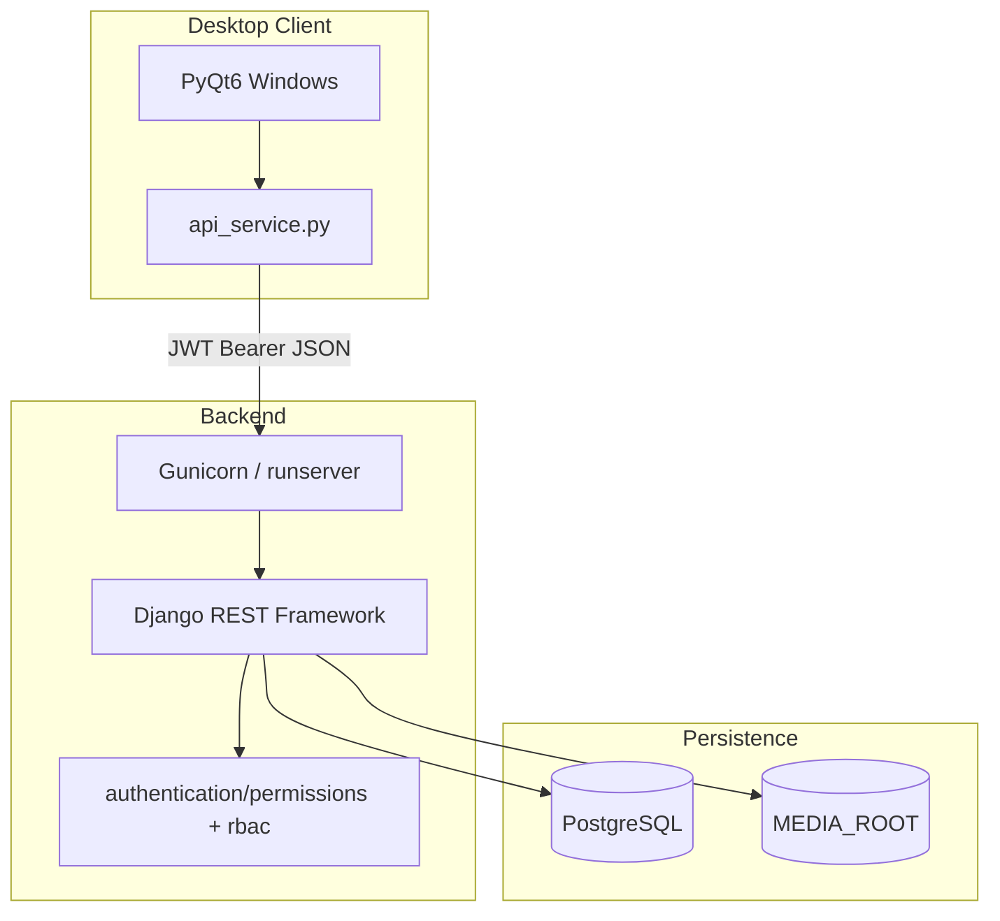

### Request flow

1. Client sends `Authorization: Bearer <access_token>`.
2. DRF authenticates and checks role permissions.
3. `rbac.py` scopes data to the user's visibility.
4. Response returned as JSON.

### Authentication flow

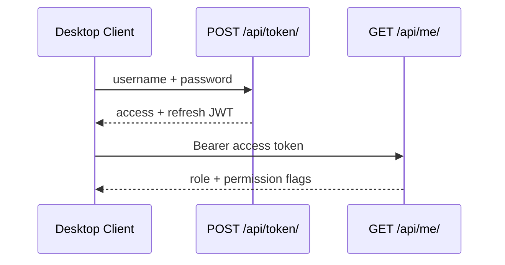

On `401`, the client refreshes via `POST /api/token/refresh/` or logs out.

| Role | Visibility |
|------|------------|
| HR | All employees and projects |
| Manager | Self + direct reports |
| Employee | Linked employee record |

---

## Project Structure

```
hrms-system/
├── README.md
├── requirements.txt
├── Dockerfile
├── docker-compose.yml
├── production.env.example
├── .env.example
├── .dockerignore
├── .gitignore
├── .github/
│   └── workflows/
│       └── ci.yml
├── scripts/
│   ├── backup_postgres.ps1
│   ├── backup_postgres.sh
│   └── restore_postgres.ps1
├── screenshots/
│   ├── api_documentation.png
│   ├── dashboard.png
│   ├── documents.png
│   ├── employee.png
│   ├── leave.png
│   ├── login_page.png
│   ├── notification.png
│   ├── payroll.png
│   └── project.png
├── backend/
│   ├── manage.py
│   ├── hrms_test_utils.py
│   ├── .env.example
│   ├── production.env.example
│   ├── .coveragerc
│   ├── config/
│   │   ├── __init__.py
│   │   ├── apps.py
│   │   ├── settings.py
│   │   ├── urls.py
│   │   ├── wsgi.py
│   │   ├── asgi.py
│   │   ├── env.py
│   │   ├── startup.py
│   │   ├── health.py
│   │   ├── exceptions.py
│   │   ├── cycle.py
│   │   ├── dates.py
│   │   ├── management/
│   │   │   ├── __init__.py
│   │   │   └── commands/
│   │   │       ├── __init__.py
│   │   │       ├── seed_demo_data.py
│   │   │       ├── seed_showcase_data.py
│   │   │       ├── backup_db.py
│   │   │       └── audit_permissions.py
│   │   ├── showcase/
│   │   │   ├── __init__.py
│   │   │   ├── constants.py
│   │   │   ├── roster.py
│   │   │   └── seed.py
│   │   └── tests/
│   │       ├── __init__.py
│   │       ├── test_health.py
│   │       ├── test_settings.py
│   │       ├── test_backup_db.py
│   │       ├── test_smoke_rbac.py
│   │       └── test_gap_closure.py
│   ├── authentication/
│   │   ├── __init__.py
│   │   ├── apps.py
│   │   ├── models.py
│   │   ├── admin.py
│   │   ├── views.py
│   │   ├── urls.py
│   │   ├── serializers.py
│   │   ├── permissions.py
│   │   ├── rbac.py
│   │   ├── groups.py
│   │   ├── signals.py
│   │   ├── audit.py
│   │   ├── token_views.py
│   │   ├── token_refresh.py
│   │   ├── throttling.py
│   │   ├── tests.py
│   │   ├── tests_audit.py
│   │   ├── management/
│   │   │   ├── __init__.py
│   │   │   └── commands/
│   │   │       ├── __init__.py
│   │   │       └── sync_hrms_groups.py
│   │   └── migrations/
│   │       ├── __init__.py
│   │       ├── 0001_initial.py
│   │       └── 0002_production_hardening.py
│   ├── employees/
│   │   ├── __init__.py
│   │   ├── apps.py
│   │   ├── models.py
│   │   ├── admin.py
│   │   ├── views.py
│   │   ├── urls.py
│   │   ├── serializers.py
│   │   ├── tests.py
│   │   └── migrations/
│   │       ├── __init__.py
│   │       ├── 0001_initial.py
│   │       ├── 0002_bankdetails_education_emergencycontact.py
│   │       ├── 0003_employee_branch.py
│   │       ├── 0004_bankdetails_branch_education_university_and_more.py
│   │       └── 0005_production_hardening.py
│   ├── attendance/
│   │   ├── __init__.py
│   │   ├── apps.py
│   │   ├── models.py
│   │   ├── admin.py
│   │   ├── services.py
│   │   ├── views.py
│   │   ├── urls.py
│   │   ├── serializers.py
│   │   ├── tests.py
│   │   └── migrations/
│   │       ├── __init__.py
│   │       ├── 0001_initial.py
│   │       └── 0002_production_hardening.py
│   ├── leaves/
│   │   ├── __init__.py
│   │   ├── apps.py
│   │   ├── models.py
│   │   ├── admin.py
│   │   ├── services.py
│   │   ├── views.py
│   │   ├── urls.py
│   │   ├── serializers.py
│   │   ├── tests.py
│   │   └── migrations/
│   │       ├── __init__.py
│   │       ├── 0001_initial.py
│   │       ├── 0002_rename_applied_at_leave_created_at_leave_updated_at_and_more.py
│   │       ├── 0003_permission.py
│   │       └── 0004_production_hardening.py
│   ├── projects/
│   │   ├── __init__.py
│   │   ├── apps.py
│   │   ├── models.py
│   │   ├── admin.py
│   │   ├── views.py
│   │   ├── urls.py
│   │   ├── serializers.py
│   │   ├── tests.py
│   │   └── migrations/
│   │       ├── __init__.py
│   │       ├── 0001_initial.py
│   │       ├── 0002_production_hardening.py
│   │       └── 0003_allocation_details.py
│   ├── documents/
│   │   ├── __init__.py
│   │   ├── apps.py
│   │   ├── models.py
│   │   ├── admin.py
│   │   ├── validators.py
│   │   ├── pdf_utils.py
│   │   ├── letter_service.py
│   │   ├── views.py
│   │   ├── urls.py
│   │   ├── serializers.py
│   │   ├── tests.py
│   │   ├── test_validators.py
│   │   └── migrations/
│   │       ├── __init__.py
│   │       ├── 0001_initial.py
│   │       ├── 0002_seed_categories.py
│   │       └── 0003_production_hardening.py
│   ├── lifecycle/
│   │   ├── __init__.py
│   │   ├── apps.py
│   │   ├── models.py
│   │   ├── admin.py
│   │   ├── onboarding_checklist.py
│   │   ├── joining_letter.py
│   │   ├── views.py
│   │   ├── urls.py
│   │   ├── serializers.py
│   │   ├── tests.py
│   │   └── migrations/
│   │       ├── __init__.py
│   │       └── 0001_initial.py
│   ├── notifications/
│   │   ├── __init__.py
│   │   ├── apps.py
│   │   ├── models.py
│   │   ├── admin.py
│   │   ├── services.py
│   │   ├── scheduler.py
│   │   ├── views.py
│   │   ├── urls.py
│   │   ├── serializers.py
│   │   ├── tests.py
│   │   ├── management/
│   │   │   ├── __init__.py
│   │   │   └── commands/
│   │   │       ├── __init__.py
│   │   │       └── generate_notifications.py
│   │   └── migrations/
│   │       ├── __init__.py
│   │       ├── 0001_initial.py
│   │       └── 0002_permission_notification_types.py
│   ├── payroll/
│   │   ├── __init__.py
│   │   ├── apps.py
│   │   ├── models.py
│   │   ├── admin.py
│   │   ├── payslip_pdf.py
│   │   ├── views.py
│   │   ├── urls.py
│   │   ├── serializers.py
│   │   ├── tests.py
│   │   └── migrations/
│   │       ├── __init__.py
│   │       ├── 0001_initial.py
│   │       └── 0002_production_hardening.py
│   └── dashboard/
│       ├── __init__.py
│       ├── apps.py
│       ├── models.py
│       ├── admin.py
│       ├── insights.py
│       ├── views.py
│       ├── urls.py
│       └── tests.py
└── frontend/
    ├── main.py
    ├── requirements.txt
    ├── .env.example
    ├── styles.qss
    ├── api_service.py
    ├── log_config.py
    ├── ui_helpers.py
    ├── table_utils.py
    ├── exporters.py
    ├── bar_chart.py
    ├── document_letter_types.py
    ├── login_window.py
    ├── dashboard.py
    ├── employee_window.py
    ├── employee_form.py
    ├── employee_profile_dialog.py
    ├── department_window.py
    ├── designation_window.py
    ├── lookup_form.py
    ├── attendance_window.py
    ├── attendance_form.py
    ├── attendance_deviation_window.py
    ├── leave_window.py
    ├── leave_form.py
    ├── permission_window.py
    ├── permission_form.py
    ├── project_window.py
    ├── project_form.py
    ├── allocate_form.py
    ├── project_self_form.py
    ├── document_window.py
    ├── document_form.py
    ├── document_generate_form.py
    ├── lifecycle_window.py
    ├── onboarding_form.py
    ├── resignation_form.py
    ├── onboarding_checklist_dialog.py
    ├── directory_window.py
    ├── self_service_window.py
    ├── report_window.py
    ├── payroll_window.py
    ├── payroll_form.py
    └── notification_window.py
```

---

## Prerequisites

| Requirement | Version |
|-------------|---------|
| Python | 3.12 |
| PostgreSQL | 16 (15+ supported) |
| pip | Latest recommended |
| Git | Any recent version |
| Docker & Docker Compose | Optional |

---

## System Requirements

| Component | Minimum | Recommended |
|-----------|---------|-------------|
| Backend server | 2 CPU, 4 GB RAM | 4 CPU, 8 GB RAM |
| PostgreSQL storage | 1 GB | 50+ GB |
| Desktop workstation | 4 GB RAM | 8 GB RAM |

---

## Installation

### Windows

```powershell
git clone <repository-url> hrms-system
cd hrms-system\backend

python -m venv venv
.\venv\Scripts\activate
pip install -r ..\requirements.txt
copy .env.example .env

python manage.py migrate
python manage.py seed_demo_data
python manage.py runserver
```

```powershell
cd ..\frontend
python -m venv venv
.\venv\Scripts\activate
pip install -r requirements.txt
copy .env.example .env
python main.py
```

### Linux

```bash
git clone <repository-url> hrms-system
cd hrms-system/backend

python3.12 -m venv venv
source venv/bin/activate
pip install -r ../requirements.txt
cp .env.example .env

python manage.py migrate
python manage.py seed_demo_data
python manage.py runserver 0.0.0.0:8000
```

```bash
cd ../frontend
python3.12 -m venv venv
source venv/bin/activate
pip install -r requirements.txt
cp .env.example .env
python main.py
```

### PostgreSQL setup

```sql
CREATE USER hrms_app WITH PASSWORD 'your_password';
CREATE DATABASE hrms_db OWNER hrms_app;
GRANT ALL PRIVILEGES ON DATABASE hrms_db TO hrms_app;
```

### Docker setup

```powershell
copy .env.example .env
copy backend\.env.example backend\.env
docker compose up --build -d
```

Copy environment templates before first run:

| Template | Target |
|----------|--------|
| `.env.example` | `.env` |
| `backend/.env.example` | `backend/.env` |
| `frontend/.env.example` | `frontend/.env` |
| `production.env.example` | `backend/.env` (production) |

---

## Configuration

### Environment variables

**Backend** (`backend/.env`):

| Variable | Description |
|----------|-------------|
| `SECRET_KEY` | Django secret key |
| `DEBUG` | `True` for development, `False` for production |
| `DB_NAME` | PostgreSQL database name |
| `DB_USER` | Database user |
| `DB_PASSWORD` | Database password |
| `DB_HOST` | `localhost` locally, `db` in Docker Compose |
| `DB_PORT` | Database port (default `5432`) |

**Frontend** (`frontend/.env`):

| Variable | Description |
|----------|-------------|
| `HRMS_API_URL` | API base URL (default `http://127.0.0.1:8000/api`) |

### Production

Set `DEBUG=False` and use `production.env.example` as a template. Production mode requires valid `SECRET_KEY`, all `DB_*` values, and `ALLOWED_HOSTS`. Run `python manage.py collectstatic --noinput` before serving.

---

## Running the System

### Backend (development)

```powershell
cd backend
.\venv\Scripts\activate
python manage.py runserver
```

### Backend (production)

```bash
gunicorn config.wsgi:application --bind 0.0.0.0:8000 --workers 3 --timeout 120
```

### Frontend

```powershell
cd frontend
.\venv\Scripts\activate
python main.py
```

### Docker

```powershell
docker compose up -d
docker compose logs -f backend
docker compose down
```

---

## Quick Start

```powershell
git clone <repository-url> hrms-system
cd hrms-system\backend
python -m venv venv && .\venv\Scripts\activate
pip install -r ..\requirements.txt
copy .env.example .env
python manage.py migrate
python manage.py seed_demo_data
python manage.py runserver
```

```powershell
cd hrms-system\frontend
python -m venv venv && .\venv\Scripts\activate
pip install -r requirements.txt
python main.py
```

Swagger UI: [http://127.0.0.1:8000/api/docs/](http://127.0.0.1:8000/api/docs/)

---

## Usage

**Login** — Launch the desktop client, sign in with JWT credentials. The sidebar shows modules based on your role (HR, Manager, or Employee).

**Employees** — HR manages employees, departments, designations, and extended profile data through the sidebar modules.

**Attendance** — Managers and HR record and review attendance. Check-in/out and cycle reports are available from the Attendance and Reports screens.

**Leave** — Submit and approve leave requests and intra-day permissions. Balances are tracked per leave type.

**Payroll** — Create monthly salary records and download payslip PDFs. Periods follow the 26th–25th cycle.

**Documents** — Upload categorized files or generate standard HR letter PDFs from the Documents module.

**Notifications** — View in-app alerts for approvals, birthdays, and anniversaries.

**Reports** — Export attendance, leave, project, attrition, and payroll data as CSV or Excel.

---

## API Documentation

| | |
|---|---|
| **Base URL** | `http://<host>:8000/api/` |
| **Authentication** | JWT Bearer token (`Authorization: Bearer <access>`) |
| **Login** | `POST /api/token/` |
| **Refresh** | `POST /api/token/refresh/` |
| **OpenAPI schema** | `GET /api/schema/` |
| **Swagger UI** | `GET /api/docs/` |

**API groups:** Health · Authentication (`/api/me/`) · Employees · Attendance · Leaves & Permissions · Projects · Documents · Lifecycle · Payroll · Notifications · Dashboard · Reports

Explore the full interactive API at `/api/docs/`.

---

## Deployment

1. Configure production environment variables (`production.env.example` → `backend/.env`, `DEBUG=False`).
2. Run migrations: `python manage.py migrate --noinput`
3. Collect static files: `python manage.py collectstatic --noinput`
4. Start Gunicorn or `docker compose up -d`
5. Verify health: `GET /api/health/ready/`

Place a TLS-terminating reverse proxy (nginx, Caddy, etc.) in front of the API for production. Set `HRMS_API_URL` on desktop clients to the public API endpoint.

---

## Screenshots

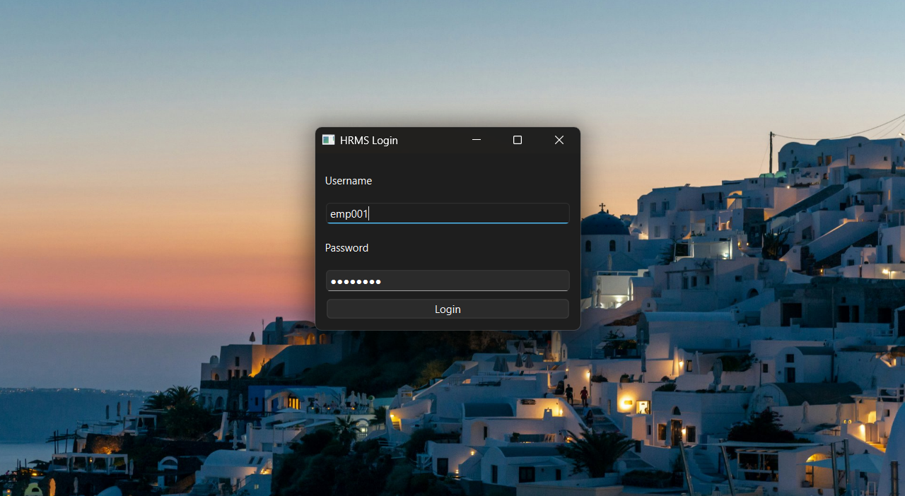

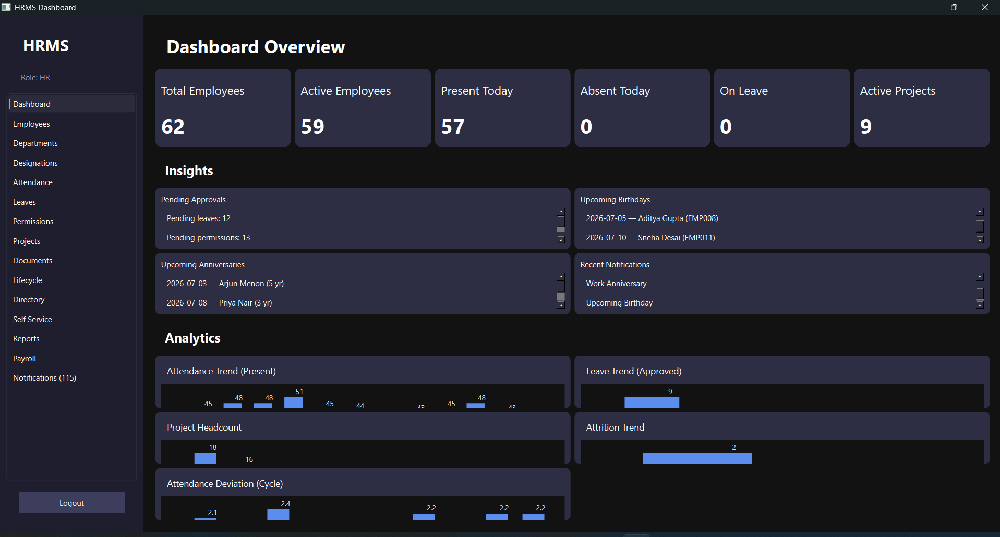

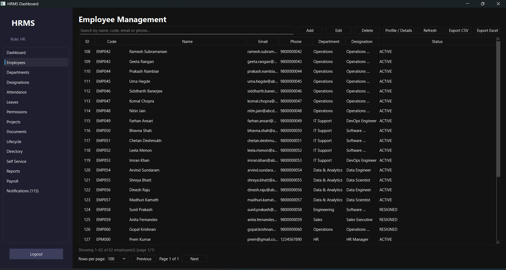

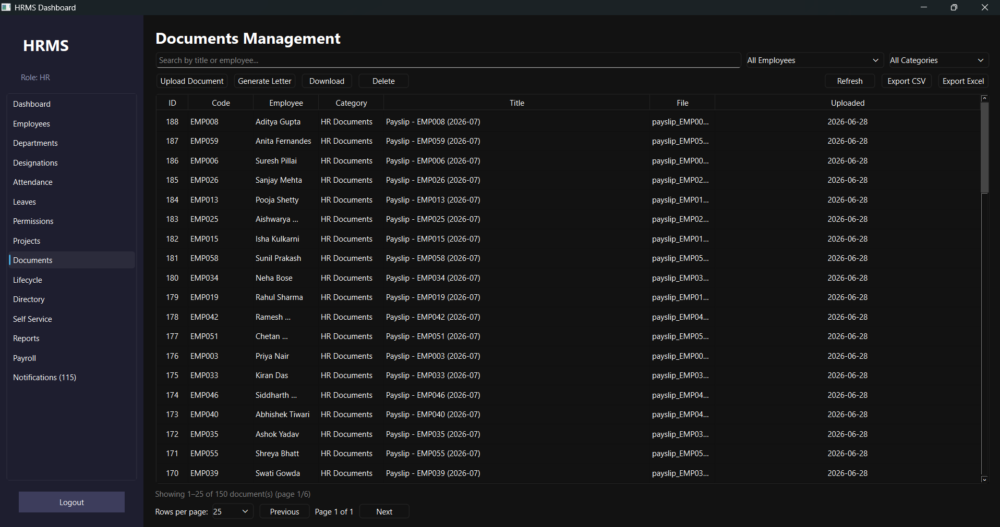

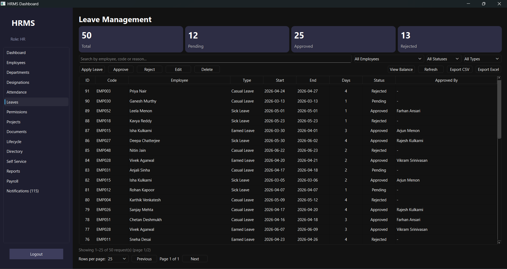

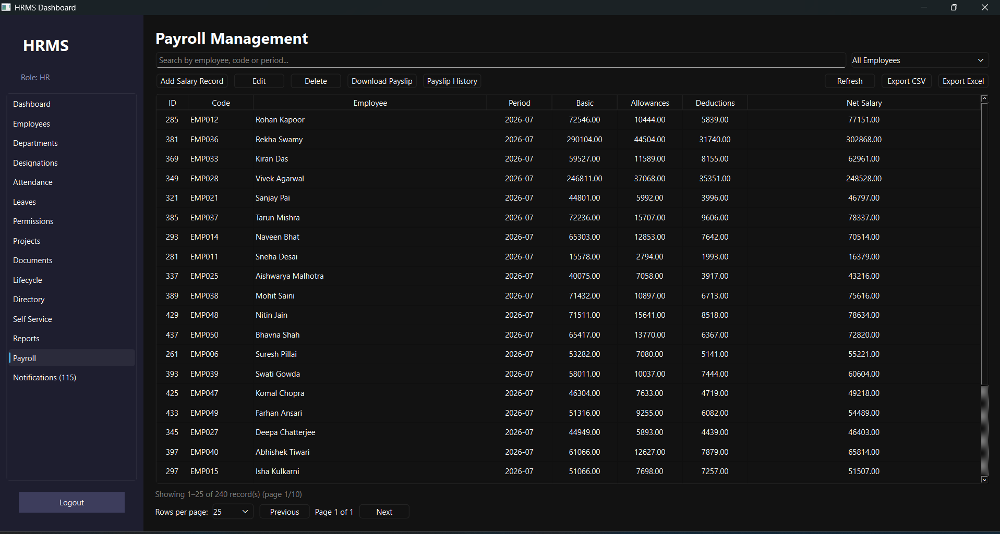

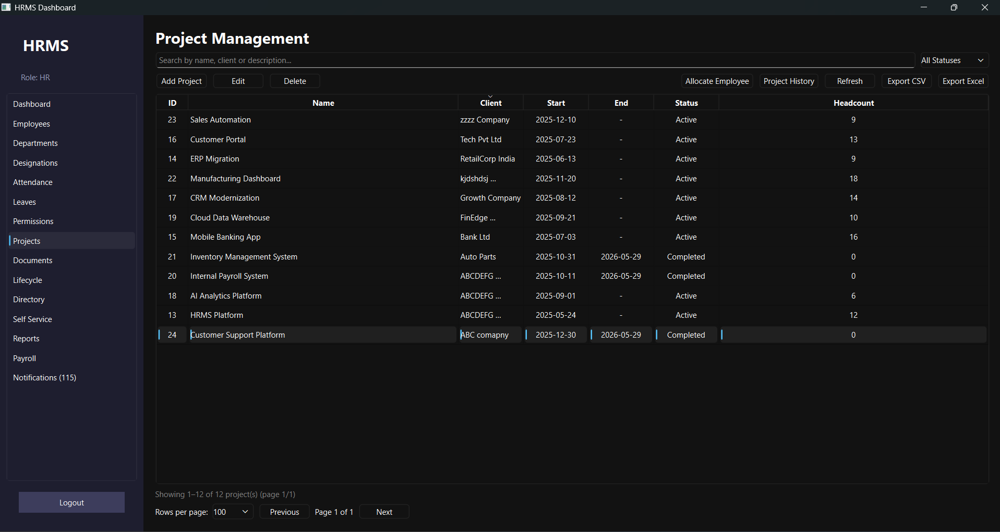

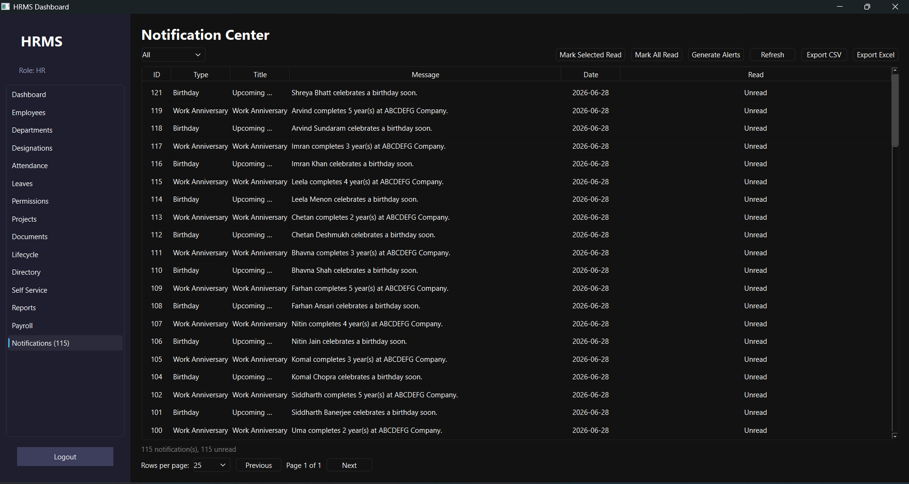

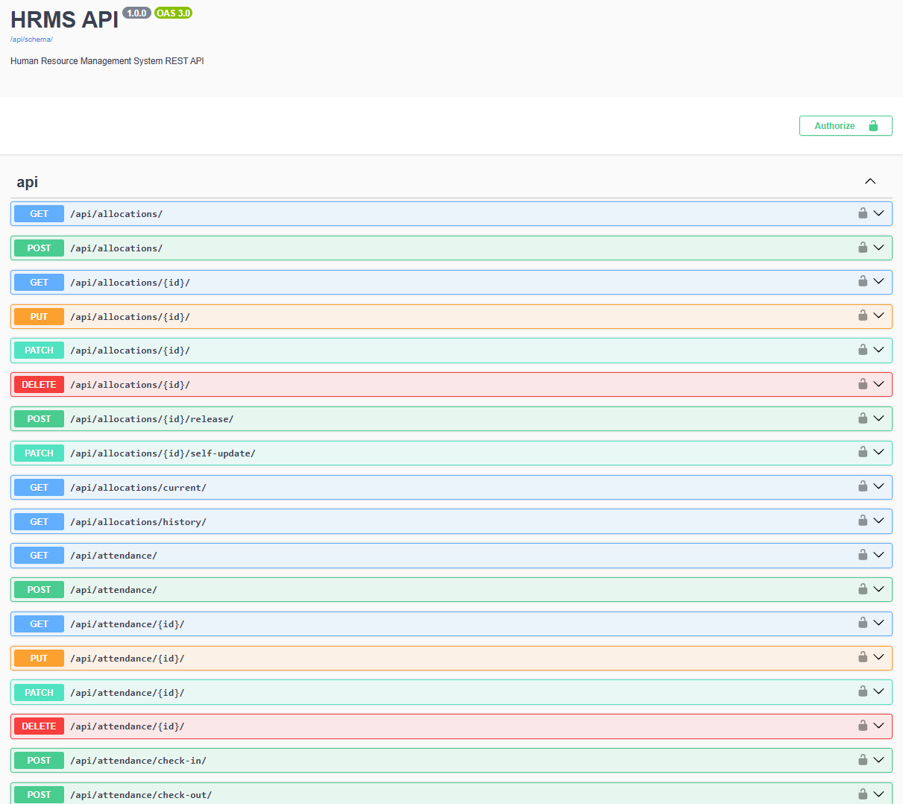

---

## Troubleshooting

**Docker** — Check `docker compose logs backend` for credential errors. Ensure `DB_PASSWORD` matches in root `.env` and `backend/.env`.

**Database** — Verify PostgreSQL is running and `DB_HOST`/`DB_PORT` are correct. Create the database if missing: `CREATE DATABASE hrms_db;`

**Authentication** — Re-login on repeated `401` responses. Ensure `SECRET_KEY` has not changed between restarts.

**Frontend** — Confirm the API is running and `HRMS_API_URL` in `frontend/.env` is correct. Check `frontend/logs/hrms-client-error.log` for crash details.

---

## Common Issues

| Error | Solution |
|-------|----------|
| `ImproperlyConfigured: Production requires 'DB_PASSWORD'` | Set all `DB_*` variables when `DEBUG=False` |
| `CORS_ALLOW_ALL_ORIGINS must be false` | Set `CORS_ALLOW_ALL_ORIGINS=False` in production |
| `Network error` in desktop client | Start the API server; verify `HRMS_API_URL` |
| `ModuleNotFoundError: PyQt6` | `pip install -r frontend/requirements.txt` |
| Migration conflicts | `python manage.py showmigrations` |

---

## Performance Tips

- Reuse database connections with `DB_CONN_MAX_AGE=60`.
- Filter large datasets by `employee`, `date`, or `status`.
- Store uploaded media on fast persistent disk in production.
- Run notification generation during off-peak hours.

---

## Contributing

1. Fork the repository and create a feature branch.
2. Set up a local environment per the Installation section.
3. Run tests: `python manage.py check`, `python manage.py test`
4. Do not commit `.env` files or secrets.
5. Open a pull request with a clear description.

---

This project does not include a license file. All rights reserved unless a `LICENSE` file is added by the repository owner.

