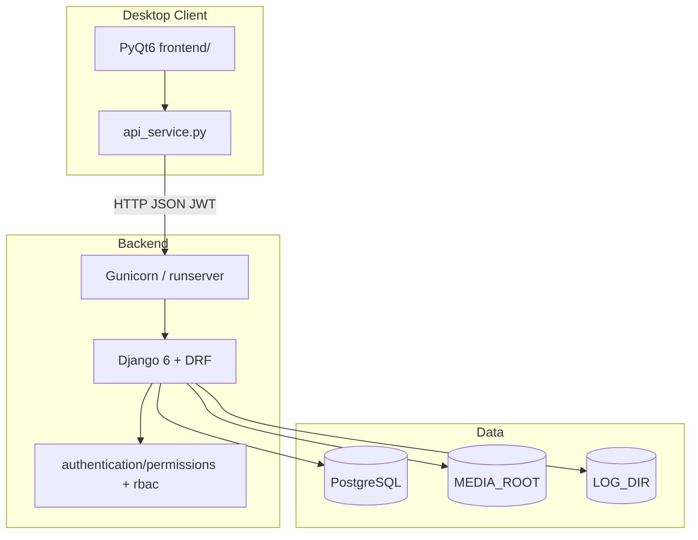
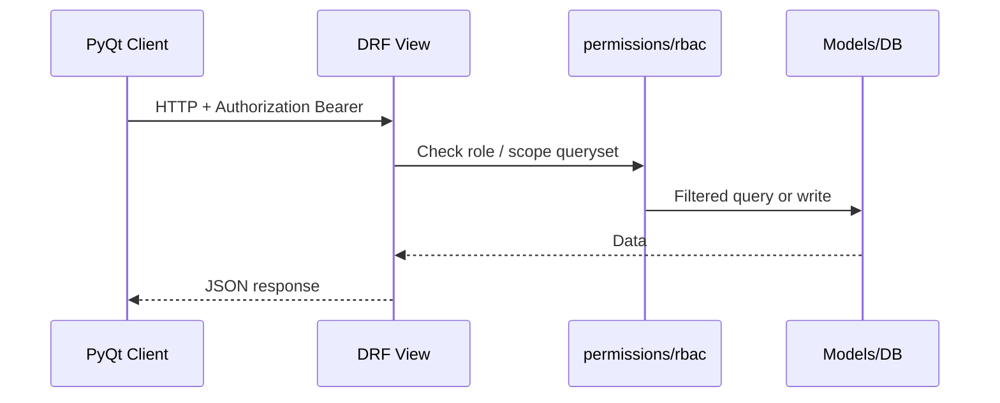
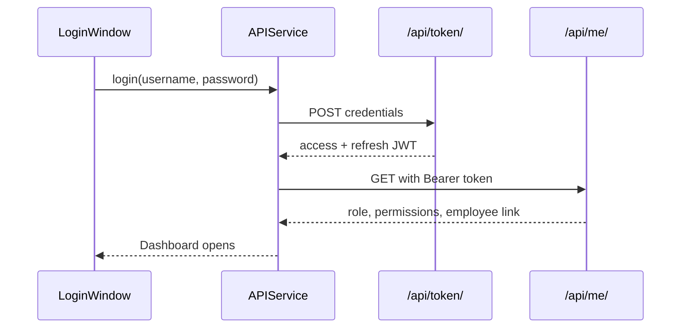
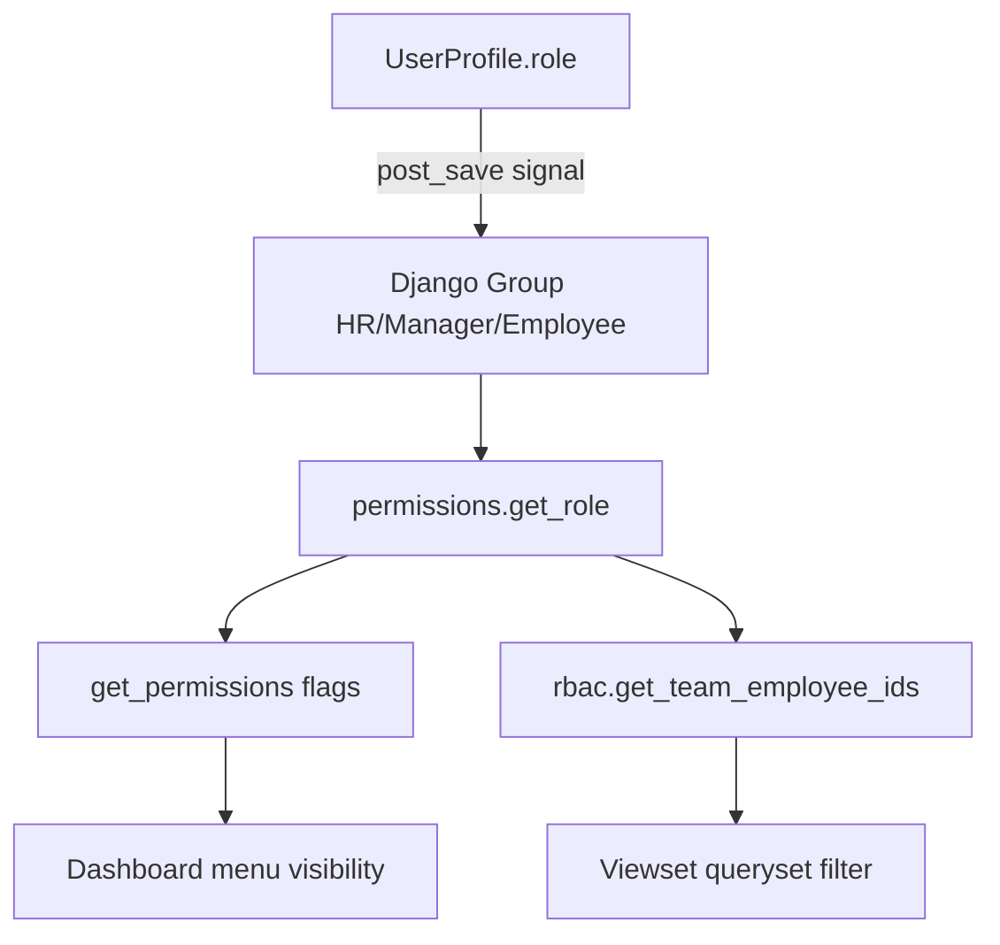
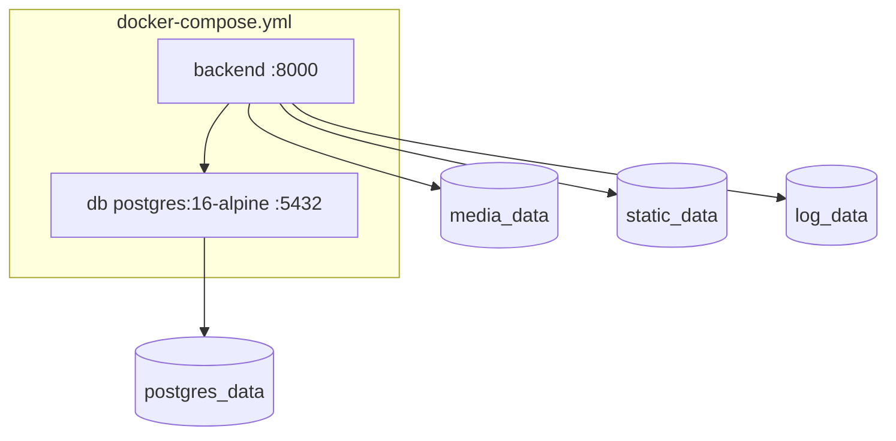
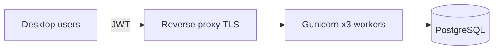
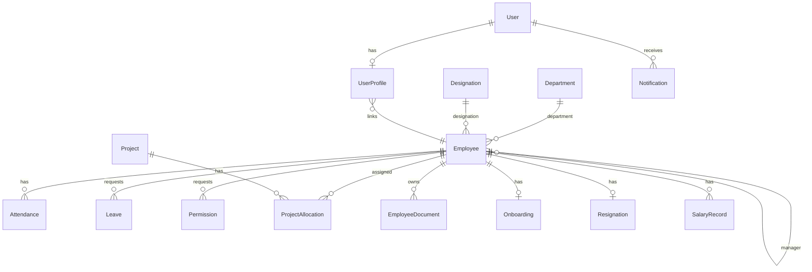
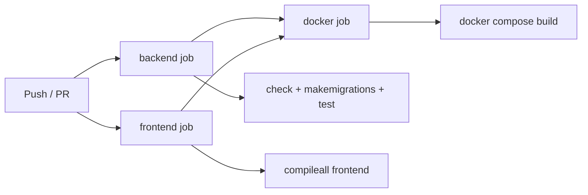

# Human Resource Management System (HRMS)

Complete technical documentation for the `hrms-system` repository. Every command, path, endpoint, and environment variable in this document is derived from the actual codebase. A developer with no prior context can clone, configure, and run the system using **only this file**.

**Audit date:** 2026-06-28 · **Backend tests:** 63 passing · **OpenAPI version:** 1.0.0

---

## Table of Contents

1. [Project Overview](#project-overview)
2. [Features](#features)
3. [Technology Stack](#technology-stack)
4. [System Architecture](#system-architecture)
5. [Project Structure](#project-structure)
6. [Django Applications](#django-applications)
7. [Frontend Architecture](#frontend-architecture)
8. [Database Design](#database-design)
9. [REST API Reference](#rest-api-reference)
10. [Environment Variables](#environment-variables)
11. [System Requirements](#system-requirements)
12. [Installation](#installation)
13. [Configuration](#configuration)
14. [Management Commands](#management-commands)
15. [Demo Credentials](#demo-credentials)
16. [Running the System](#running-the-system)
17. [Testing and CI/CD](#testing-and-cicd)
18. [Deployment](#deployment)
19. [Production Checklist](#production-checklist)
20. [Security](#security)
21. [Notification Scheduler](#notification-scheduler)
22. [Backup and Restore](#backup-and-restore)
23. [Health Checks, Logging, and Monitoring](#health-checks-logging-and-monitoring)
24. [Troubleshooting](#troubleshooting)
25. [Project Audit and Readiness](#project-audit-and-readiness)
26. [Known Limitations and Future Work](#known-limitations-and-future-work)
27. [Architecture Decisions](#architecture-decisions)
28. [Maintenance, Release, and Disaster Recovery](#maintenance-release-and-disaster-recovery)
29. [Processing Modes](#processing-modes)
30. [Screenshots](#screenshots)
31. [FAQ](#faq)
32. [Contributing and License](#contributing-and-license)

---

## Project Overview

HRMS is an internal Human Resource Management platform consisting of:

1. **Backend** — Django 6 + Django REST Framework REST API with PostgreSQL, JWT authentication, and role-based access control (HR / Manager / Employee).
2. **Desktop client** — PyQt6 application that consumes the REST API (not containerized).
3. **Deployment** — Docker Compose runs PostgreSQL + Gunicorn backend; the desktop client runs on end-user machines.

Core domains: employees, attendance, leaves, permissions (short time-off), projects, documents (upload + generated letters), onboarding/resignation lifecycle, notifications, payroll records, dashboards, and tabular reports.

---

## Features

| Module | Backend | Desktop UI |
|--------|---------|------------|
| Employee master + education/bank/ID/emergency | `employees` | Employees, Self Service, Directory |
| Departments & designations | `employees` | Departments, Designations |
| Attendance + check-in/out + cycle reports | `attendance` | Attendance, Reports |
| Leave requests + balance + approval | `leaves` | Leaves, Self Service |
| Permission (intra-day time off) | `leaves.Permission` | Permissions |
| Projects + allocations | `projects` | Projects |
| Document upload + 6 letter types | `documents` | Documents |
| Onboarding + resignation | `lifecycle` | Lifecycle |
| Salary records + payslip PDF | `payroll` | Payroll |
| Notifications + scheduler | `notifications` | Notifications |
| Dashboard stats/analytics/insights | `dashboard` | Dashboard |
| Tabular exports (CSV/Excel) | Report API + `exporters.py` | Reports |
| JWT login + audit trail | `authentication` | Login |
| OpenAPI / Swagger | `drf-spectacular` | Browser: `/api/docs/` |

---

## Technology Stack

| Layer | Technology | Version (repo) |
|-------|------------|----------------|
| Language | Python | 3.12 (CI, Dockerfile) |
| Web framework | Django | 6.0.6 |
| API | Django REST Framework | 3.17.1 |
| Auth | djangorestframework-simplejwt | 5.5.1 |
| API docs | drf-spectacular | 0.28.0 |
| CORS | django-cors-headers | 4.9.0 |
| Database driver | psycopg2-binary | 2.9.12 |
| Config | python-dotenv | 1.2.2 |
| WSGI server (Docker) | gunicorn | 23.0.0 |
| Database | PostgreSQL | 16 |
| Desktop UI | PyQt6 | ≥6.6 |
| HTTP client | requests | ≥2.31 |
| Excel export | openpyxl | ≥3.1 |

**Backend dependencies** (`requirements.txt`): Django, DRF, simplejwt, cors-headers, psycopg2-binary, python-dotenv, drf-spectacular, gunicorn.

**Frontend dependencies** (`frontend/requirements.txt`): PyQt6, requests, openpyxl, python-dotenv.

---

## System Architecture

### High-level architecture



### Request flow



### Authentication flow



1. `POST /api/token/` — `AuditedTokenObtainPairView` issues JWT; logins recorded in `AuditLog`.
2. `GET /api/me/` — returns `username`, `role`, `employee`, `permissions` map.
3. On `401`, client calls `POST /api/token/refresh/`; on failure, session-expired callback logs user out.

### RBAC



| Role | Employee visibility (`authentication/rbac.py`) |
|------|-----------------------------------------------|
| HR | All employees (`team_ids = None`) |
| Manager | Self + direct reports (`Employee.manager_id`) |
| Employee | Linked employee only (`UserProfile.employee`) |

Project visibility: HR sees all; Manager/Employee see projects with team/self allocations.

- **Groups:** `HR`, `Manager`, `Employee` (`authentication/groups.py`)
- **DRF classes:** `IsHROrReadOnly`, `IsManagerOrHR`, `IsHROrManagerOrReadOnly`
- **Scoping helpers:** `filter_employees_for_user`, `filter_by_employee_scope`, `filter_projects_for_user`

### Domain flows

**Documents:** UI → `POST /api/documents/generate/` → `letter_service` → `pdf_utils.build_simple_pdf` → `EmployeeDocument` in `MEDIA_ROOT`. Letter types: `offer`, `appointment`, `experience`, `relieving`, `warning`, `promotion`.

**Payroll:** `SalaryRecord` CRUD → `GET /api/salaries/{id}/payslip/` → `payslip_pdf.build_payslip_pdf`. Period = `YYYY-MM` of cycle end month (`config/cycle.py`).

**Attendance:** Check-in/out actions or manual CRUD; `attendance/services.py` computes `is_late` (shift 09:30, 10 min grace), `working_hours`, `derive_status` (8h standard, 4h half-day).

**Notifications:** Cron/Task Scheduler → `generate_notifications` → `scheduler.run_scheduled_notifications()` → `services.generate_event_notifications()` (idempotent per day).

**Dashboard:** Parallel calls to `/api/dashboard/stats/`, `/analytics/`, `/insights/`; charts via `BarChartWidget`.

### Payroll / attendance cycle (`config/cycle.py`)

- Cycle: **26th of month N** through **25th of month N+1**
- `SalaryRecord.period` = `YYYY-MM` of the **cycle end month**
- Attendance summaries and payroll reports use `get_cycle_range()` and `cycle_period_label()`

### PDF generation

No ReportLab. Custom builders: `documents/pdf_utils.py`, `payroll/payslip_pdf.py`, `lifecycle/joining_letter.py`.

### Docker architecture



The PyQt6 client is **not** in Docker. It runs on the host and connects to `http://host:8000/api`.

### Production deployment architecture



### App dependency graph

```
employees (core master data)
    ↑ attendance, leaves, projects, documents, lifecycle, payroll, notifications, authentication.UserProfile

authentication → all viewsets (permissions + scoping)
config → settings, health, cycle, showcase seed, backup_db
dashboard → read-only aggregation over scoped querysets
```

---

## Project Structure

Source tree scanned **2026-06-28**. Runtime directories (`backend/media/`, `backend/logs/`, `frontend/logs/`, local `.env`, `venv/`) are created at runtime.

```
hrms-system/
├── README.md                              # Complete project documentation (this file)
├── requirements.txt                       # Backend Python dependencies (Docker + CI)
├── Dockerfile                             # Backend container image (Python 3.12-slim)
├── docker-compose.yml                     # PostgreSQL 16 + backend API stack
├── .env.example                           # Docker Compose DB_* template
├── production.env.example                 # Production backend environment template
├── .dockerignore                          # Docker build context exclusions
├── .gitignore                             # Ignores venv, .env, logs, media, coverage
├── .github/
│   └── workflows/
│       └── ci.yml                         # GitHub Actions CI pipeline
├── scripts/
│   ├── backup_postgres.ps1                # Windows pg_dump backup
│   ├── backup_postgres.sh                 # Linux/macOS pg_dump backup
│   └── restore_postgres.ps1               # Windows pg_restore
├── screenshots/
│   ├── api_documentation.png
│   ├── dashboard.png
│   ├── documents.png
│   ├── employee.png
│   ├── leave.png
│   ├── login_page.png
│   ├── notification.png
│   ├── payroll.png
│   └── project.png
├── backend/
│   ├── manage.py                          # Django CLI entry point
│   ├── hrms_test_utils.py                 # Shared test helpers
│   ├── .env.example                       # Local/Docker backend env template
│   ├── production.env.example             # Alternate production template
│   ├── .coveragerc                        # Coverage gate: fail_under 70%
│   ├── logs/                              # Runtime: hrms.log, hrms-error.log
│   ├── media/                             # Runtime: MEDIA_ROOT uploads/PDFs
│   │   └── employee_documents/
│   ├── config/
│   │   ├── settings.py                    # Django, DRF, JWT, logging, prod validation
│   │   ├── urls.py                        # Root URL router
│   │   ├── wsgi.py                        # Gunicorn entry
│   │   ├── asgi.py
│   │   ├── env.py                         # Environment variable helpers
│   │   ├── startup.py                     # run_startup_checks()
│   │   ├── health.py                      # /api/health/ endpoints
│   │   ├── exceptions.py                  # DRF exception handler
│   │   ├── cycle.py                       # 26th→25th payroll/attendance cycle
│   │   ├── dates.py                       # parse_date() for query params
│   │   ├── management/commands/
│   │   │   ├── seed_demo_data.py
│   │   │   ├── seed_showcase_data.py
│   │   │   ├── backup_db.py
│   │   │   └── audit_permissions.py
│   │   ├── showcase/
│   │   │   ├── constants.py
│   │   │   ├── roster.py
│   │   │   └── seed.py
│   │   └── tests/
│   │       ├── test_health.py
│   │       ├── test_settings.py
│   │       ├── test_backup_db.py
│   │       ├── test_smoke_rbac.py
│   │       └── test_gap_closure.py
│   ├── authentication/
│   │   ├── models.py                      # UserProfile, AuditLog
│   │   ├── views.py                       # /api/me/, /api/me/profile/
│   │   ├── permissions.py                 # DRF permission classes, get_permissions()
│   │   ├── rbac.py                        # Queryset scoping
│   │   ├── groups.py                      # Django Group sync
│   │   ├── signals.py                     # post_save → sync groups
│   │   ├── audit.py                       # log_audit(), snapshot_model()
│   │   ├── token_views.py                 # POST /api/token/
│   │   ├── token_refresh.py               # POST /api/token/refresh/
│   │   ├── throttling.py
│   │   ├── tests.py
│   │   ├── tests_audit.py
│   │   ├── management/commands/sync_hrms_groups.py
│   │   └── migrations/
│   │       ├── 0001_initial.py
│   │       └── 0002_production_hardening.py
│   ├── employees/
│   │   ├── models.py                      # 7 models
│   │   ├── views.py
│   │   ├── urls.py
│   │   ├── serializers.py
│   │   ├── tests.py
│   │   └── migrations/                    # 0001–0005
│   ├── attendance/
│   │   ├── models.py
│   │   ├── services.py
│   │   ├── views.py
│   │   ├── urls.py
│   │   ├── serializers.py
│   │   ├── tests.py
│   │   └── migrations/                    # 0001–0002
│   ├── leaves/
│   │   ├── models.py                      # Leave, Permission
│   │   ├── services.py                    # LEAVE_ALLOCATION, balances
│   │   ├── views.py
│   │   ├── urls.py
│   │   ├── serializers.py
│   │   ├── tests.py
│   │   └── migrations/                    # 0001–0004
│   ├── projects/
│   │   ├── models.py
│   │   ├── views.py
│   │   ├── urls.py
│   │   ├── serializers.py
│   │   ├── tests.py
│   │   └── migrations/                    # 0001–0003
│   ├── documents/
│   │   ├── models.py
│   │   ├── validators.py
│   │   ├── pdf_utils.py
│   │   ├── letter_service.py
│   │   ├── views.py
│   │   ├── urls.py
│   │   ├── serializers.py
│   │   ├── tests.py
│   │   ├── test_validators.py
│   │   └── migrations/                    # 0001–0003
│   ├── lifecycle/
│   │   ├── models.py
│   │   ├── onboarding_checklist.py
│   │   ├── joining_letter.py
│   │   ├── views.py
│   │   ├── urls.py
│   │   ├── serializers.py
│   │   ├── tests.py
│   │   └── migrations/0001_initial.py
│   ├── notifications/
│   │   ├── models.py
│   │   ├── services.py
│   │   ├── scheduler.py
│   │   ├── views.py
│   │   ├── urls.py
│   │   ├── serializers.py
│   │   ├── tests.py
│   │   ├── management/commands/generate_notifications.py
│   │   └── migrations/                    # 0001–0002
│   ├── payroll/
│   │   ├── models.py
│   │   ├── payslip_pdf.py
│   │   ├── views.py
│   │   ├── urls.py
│   │   ├── serializers.py
│   │   ├── tests.py
│   │   └── migrations/                    # 0001–0002
│   └── dashboard/
│       ├── models.py                      # Empty placeholder
│       ├── insights.py
│       ├── views.py
│       ├── urls.py
│       └── tests.py
└── frontend/
    ├── main.py                            # Application entry
    ├── requirements.txt
    ├── .env.example
    ├── styles.qss                         # Present; empty/unused
    ├── logs/                              # Runtime client logs
    ├── api_service.py                     # REST client for all endpoints
    ├── log_config.py
    ├── ui_helpers.py
    ├── table_utils.py
    ├── exporters.py
    ├── bar_chart.py
    ├── document_letter_types.py
    ├── login_window.py
    ├── dashboard.py                       # Main shell (15 menu pages)
    ├── employee_window.py
    ├── employee_form.py
    ├── employee_profile_dialog.py
    ├── department_window.py
    ├── designation_window.py
    ├── lookup_form.py
    ├── attendance_window.py
    ├── attendance_form.py
    ├── attendance_deviation_window.py
    ├── leave_window.py
    ├── leave_form.py
    ├── permission_window.py
    ├── permission_form.py
    ├── project_window.py
    ├── project_form.py
    ├── allocate_form.py
    ├── project_self_form.py
    ├── document_window.py
    ├── document_form.py
    ├── document_generate_form.py
    ├── lifecycle_window.py
    ├── onboarding_form.py
    ├── resignation_form.py
    ├── onboarding_checklist_dialog.py
    ├── directory_window.py
    ├── self_service_window.py
    ├── report_window.py
    ├── payroll_window.py
    ├── payroll_form.py
    └── notification_window.py
```

### Repository responsibilities

| Zone | Responsibility |
|------|----------------|
| Repo root | Docker, dependencies, CI configuration |
| `backend/` | REST API, business logic, PostgreSQL, JWT/RBAC, PDF generation |
| `frontend/` | PyQt6 desktop UI, API client, exports |
| `scripts/` | Host-level PostgreSQL backup/restore |
| `.github/` | Automated tests and Docker build on push/PR |
| `screenshots/` | UI documentation images |

### Startup sequence

**Local backend:** `manage.py` → `settings.py` (load `.env`) → `authentication.apps.ready()` (signals + `run_startup_checks`) → `runserver`.

**Docker:** `db` healthy → `migrate` → `collectstatic` → Gunicorn `:8000` → healthcheck `GET /api/health/`.

**Desktop:** `main.py` → logging → `LoginWindow` → JWT login → `GET /api/me/` → `Dashboard` with RBAC sidebar.

### File execution order (API request)

`wsgi.py` → `settings.py` → `authentication/apps.py` `ready()` → `urls.py` → view → `permissions.py` → `rbac.py` → serializer → model/DB.

---

## Django Applications

| App | Models | Key APIs | Write policy |
|-----|--------|----------|--------------|
| `config` | 0 | `/api/health/`, `/api/health/ready/` | Public |
| `authentication` | UserProfile, AuditLog | `/api/token/`, `/api/me/` | JWT |
| `employees` | 7 | `/api/departments/`, `/api/employees/`, etc. | HR writes |
| `attendance` | Attendance | `/api/attendance/` + actions | HR/Manager; self check-in/out |
| `leaves` | Leave, Permission | `/api/leaves/`, `/api/permissions/` | Approve: Manager/HR |
| `projects` | Project, ProjectAllocation | `/api/projects/`, `/api/allocations/` | HR writes |
| `documents` | DocumentCategory, EmployeeDocument | `/api/documents/` + generate | HR writes |
| `lifecycle` | Onboarding, Resignation | `/api/onboardings/`, `/api/resignations/` | HR writes |
| `notifications` | Notification | `/api/notifications/` | Authenticated |
| `payroll` | SalaryRecord | `/api/salaries/` + payslip | HR writes |
| `dashboard` | 0 | `/api/dashboard/*`, `/api/reports/*` | Read only |

**Leave allocations** (`leaves/services.py`): CL 12, SL 12, EL 15 per calendar year.

---

## Frontend Architecture

### PyQt windows (16 `*_window.py`)

| File | Menu | Role gating |
|------|------|-------------|
| `login_window.py` | Entry | All |
| `dashboard.py` | Dashboard + shell | RBAC-filtered modules |
| `employee_window.py` | Employees | HR |
| `department_window.py` | Departments | HR |
| `designation_window.py` | Designations | HR |
| `attendance_window.py` | Attendance | HR/Manager |
| `leave_window.py` | Leaves | HR/Manager |
| `permission_window.py` | Permissions | HR/Manager |
| `project_window.py` | Projects | HR/Manager |
| `document_window.py` | Documents | HR |
| `lifecycle_window.py` | Lifecycle | HR |
| `directory_window.py` | Directory | All |
| `self_service_window.py` | Self Service | All |
| `report_window.py` | Reports | HR/Manager |
| `payroll_window.py` | Payroll | HR/Manager |
| `notification_window.py` | Notifications | All |
| `attendance_deviation_window.py` | Embedded in Reports | HR/Manager |

Sidebar menu items defined in `dashboard.py` `MENU_ITEMS` (15 entries).

---

## Database Design

### ER diagram



**18 domain models** · **24 migration files** · CI enforces `makemigrations --check`.

---

## REST API Reference

**Base URL:** `http://<host>:8000/api/`  
**Auth:** `Authorization: Bearer <access_token>`  
**OpenAPI schema:** `GET /api/schema/`  
**Swagger UI:** `GET /api/docs/`

### Authentication

| Method | Path | Auth | Description |
|--------|------|------|-------------|
| POST | `/api/token/` | No | Obtain access + refresh tokens |
| POST | `/api/token/refresh/` | Refresh token | Refresh access token |
| GET | `/api/me/` | Yes | Username, role, employee link, permission flags |
| GET/PATCH | `/api/me/profile/` | Yes | Self-service employee profile |

### Health

| Method | Path | Auth | Description |
|--------|------|------|-------------|
| GET | `/api/health/` | No | Liveness — `{"status":"ok"}` |
| GET | `/api/health/ready/` | No | Readiness — DB ping; `503` if DB down |

### Employees

| Resource | Path | Verbs |
|----------|------|-------|
| Departments | `/api/departments/` | GET, POST, PUT, PATCH, DELETE |
| Designations | `/api/designations/` | GET, POST, PUT, PATCH, DELETE |
| Employees | `/api/employees/` | GET, POST, PUT, PATCH, DELETE |
| Education | `/api/education/` | GET, POST, PUT, PATCH, DELETE |
| Bank details | `/api/bank-details/` | GET, POST, PUT, PATCH, DELETE |
| ID proofs | `/api/id-proofs/` | GET, POST, PUT, PATCH, DELETE |
| Emergency contacts | `/api/emergency-contacts/` | GET, POST, PUT, PATCH, DELETE |

Writes require HR role (`IsHROrReadOnly`). Search via `?search=` on supported fields.

### Attendance

| Method | Path | Description |
|--------|------|-------------|
| CRUD | `/api/attendance/` | Manual attendance records |
| POST | `/api/attendance/check-in/` | Body: `{"employee": <id>}` |
| POST | `/api/attendance/check-out/` | Body: `{"employee": <id>}` |
| GET | `/api/attendance/summary/` | Cycle summary (`?employee=`, `?date=`) |
| GET | `/api/attendance/report/` | Per-employee cycle deviation report |
| GET | `/api/attendance/history/` | `?employee=` required |

### Leaves and permissions

| Method | Path | Description |
|--------|------|-------------|
| CRUD | `/api/leaves/` | Leave requests (CL, SL, EL) |
| POST | `/api/leaves/{id}/approve/` | Manager/HR only |
| POST | `/api/leaves/{id}/reject/` | Manager/HR only |
| GET | `/api/leaves/balance/` | `?employee=` required |
| GET | `/api/leaves/history/` | `?employee=` required |
| CRUD | `/api/permissions/` | Same-day time-off requests |
| POST | `/api/permissions/{id}/approve/` | Manager/HR only |
| POST | `/api/permissions/{id}/reject/` | Manager/HR only |

### Projects

| Method | Path | Description |
|--------|------|-------------|
| CRUD | `/api/projects/` | Project portfolio |
| GET | `/api/projects/headcount/` | Active headcount per project |
| GET | `/api/projects/{id}/allocations/` | Allocation history for project |
| POST | `/api/projects/{id}/allocate/` | Allocate employee to project |
| CRUD | `/api/allocations/` | Allocation records |
| POST | `/api/allocations/{id}/release/` | End allocation |
| GET | `/api/allocations/current/` | `?employee=` — active allocations |
| GET | `/api/allocations/history/` | `?employee=` — full history |
| PATCH | `/api/allocations/{id}/self-update/` | Employee updates own active allocation |

### Documents

| Method | Path | Description |
|--------|------|-------------|
| CRUD | `/api/document-categories/` | Document categories |
| CRUD | `/api/documents/` | Upload/list documents |
| GET | `/api/documents/{id}/download/` | Download file |
| POST | `/api/documents/generate/` | Generate letter PDF (`letter_type`, `employee`, `notes`, `new_designation`) |

### Lifecycle

| Method | Path | Description |
|--------|------|-------------|
| CRUD | `/api/onboardings/` | Onboarding records |
| GET | `/api/onboardings/{id}/joining-letter/` | Joining letter PDF |
| GET | `/api/onboardings/{id}/document-checklist/` | Required docs + upload status |
| CRUD | `/api/resignations/` | Exit records |

### Notifications

| Method | Path | Description |
|--------|------|-------------|
| CRUD | `/api/notifications/` | List notifications (`?unread=true`) |
| GET | `/api/notifications/unread-count/` | Unread count |
| POST | `/api/notifications/{id}/mark-read/` | Mark one read |
| POST | `/api/notifications/mark-all-read/` | Mark all read |
| POST | `/api/notifications/generate/` | Run scheduler (same as management command) |

### Payroll

| Method | Path | Description |
|--------|------|-------------|
| CRUD | `/api/salaries/` | Monthly salary records |
| GET | `/api/salaries/{id}/payslip/` | Payslip PDF download |

### Dashboard and reports

| Method | Path | Description |
|--------|------|-------------|
| GET | `/api/dashboard/stats/` | Summary KPI cards |
| GET | `/api/dashboard/analytics/` | Chart trend data |
| GET | `/api/dashboard/insights/` | Pending approvals, birthdays, notifications |
| GET | `/api/reports/attendance/` | Tabular attendance (`?start=`, `?end=`, `?search=`) |
| GET | `/api/reports/leave/` | Tabular leave report |
| GET | `/api/reports/project-headcount/` | Project headcount table |
| GET | `/api/reports/attrition/` | Resignation report (`?year=`) |
| GET | `/api/reports/payroll/` | Payroll summary (`?period=` or `?date=`) |

### Django admin

`/admin/` — session-based Django admin (separate from JWT API).

---

## Environment Variables

### Root `.env.example` (Docker Compose)

| Variable | Default | Purpose |
|----------|---------|---------|
| `DB_NAME` | `hrms_db` | PostgreSQL database name |
| `DB_USER` | `postgres` | PostgreSQL user |
| `DB_PASSWORD` | `postgres` | Must align with `backend/.env` and existing volume |

### `backend/.env.example`

| Variable | Default | Required (prod) | Purpose |
|----------|---------|-----------------|---------|
| `SECRET_KEY` | insecure dev fallback in code | Yes | Django secret |
| `DEBUG` | `True` | Set `False` | Production validation when false |
| `ALLOWED_HOSTS` | `127.0.0.1,localhost` | Yes | Host header allowlist |
| `DB_NAME` | `hrms_db` | Yes | Database name |
| `DB_USER` | `postgres` | Yes | Database user |
| `DB_PASSWORD` | empty | Yes | Database password |
| `DB_HOST` | `localhost` | Yes | Use `db` in Docker |
| `DB_PORT` | `5432` | Yes | Database port |
| `DB_CONN_MAX_AGE` | `60` | Optional | Connection pooling seconds |
| `DB_CONN_HEALTH_CHECKS` | `True` | Optional | Django DB health checks |
| `DB_CONNECT_TIMEOUT` | `10` | Optional | Connect timeout seconds |
| `CORS_ALLOW_ALL_ORIGINS` | `True` if DEBUG | Must be `False` | Wide CORS (browser clients) |
| `CORS_ALLOWED_ORIGINS` | empty | Yes if prod | Explicit origin list |
| `STATIC_URL` | `/static/` | Optional | Static URL prefix |
| `STATIC_ROOT` | `staticfiles` | Optional | collectstatic target |
| `MEDIA_URL` | `/media/` | Optional | Media URL prefix |
| `MEDIA_ROOT` | `media` | Optional | Upload directory |
| `HRMS_MAX_UPLOAD_BYTES` | `5242880` | Optional | Max upload (5 MB) |
| `DATA_UPLOAD_MAX_MEMORY_SIZE` | `10485760` | Optional | Django request limit |
| `FILE_UPLOAD_MAX_MEMORY_SIZE` | `10485760` | Optional | Django file memory limit |
| `LOG_DIR` | `logs` | Optional | Log directory |
| `LOG_LEVEL` | `INFO` | Optional | Application log level |
| `DJANGO_LOG_LEVEL` | `INFO` | Optional | Django logger level |
| `TIME_ZONE` | `Asia/Kolkata` | Optional | Application timezone |
| `SESSION_COOKIE_SECURE` | `not DEBUG` | `True` in prod | Secure session cookie |
| `CSRF_COOKIE_SECURE` | `not DEBUG` | `True` in prod | Secure CSRF cookie |
| `SECURE_SSL_REDIRECT` | `not DEBUG` | Optional | Force HTTPS redirect |
| `USE_SECURE_PROXY_SSL_HEADER` | `not DEBUG` | `True` behind proxy | Trust `X-Forwarded-Proto` |
| `SECURE_HSTS_SECONDS` | `31536000` if not DEBUG | Optional | HSTS max-age |
| `SECURE_HSTS_INCLUDE_SUBDOMAINS` | `not DEBUG` | Optional | HSTS subdomains |
| `SECURE_HSTS_PRELOAD` | `False` | Optional | HSTS preload |
| `JWT_ACCESS_MINUTES` | `60` | Optional | Access token lifetime |
| `JWT_REFRESH_DAYS` | `1` | Optional | Refresh token lifetime |
| `HRMS_LOGIN_THROTTLE` | `20/minute` | Optional | Login rate limit |
| `HRMS_TOKEN_REFRESH_THROTTLE` | `60/minute` | Optional | Token refresh rate limit |

### `frontend/.env.example`

| Variable | Default | Purpose |
|----------|---------|---------|
| `HRMS_API_URL` | `http://127.0.0.1:8000/api` | API base URL including `/api` |

**Production:** Copy `production.env.example` → `backend/.env` and set all secrets before go-live.

Generate a secret key:

```bash
python -c "import secrets; print(secrets.token_urlsafe(64))"
```

---

## System Requirements

| Component | Minimum | Recommended |
|-----------|---------|-------------|
| Backend server | 2 CPU, 4 GB RAM | 4 CPU, 8 GB RAM |
| PostgreSQL disk | 1 GB (demo) | 50+ GB (production + media) |
| Desktop client | 4 GB RAM | 8 GB RAM, 1920×1080 |

**Software:** Python 3.12, PostgreSQL 16, Docker 24+ (optional), `pg_dump`/`pg_restore` for backups.

---

## Installation

### Windows — local development

```powershell
git clone <repository-url> hrms-system
cd hrms-system\backend
python -m venv venv
.\venv\Scripts\activate
pip install -r ..\requirements.txt
copy .env.example .env
# Edit .env — set DB_PASSWORD; create database hrms_db in PostgreSQL
python manage.py migrate
python manage.py seed_demo_data
python manage.py runserver
```

```powershell
cd ..\frontend
python -m venv venv
.\venv\Scripts\activate
pip install -r requirements.txt
copy .env.example .env
python main.py
```

### Linux — local development

```bash
git clone <repository-url> hrms-system
cd hrms-system/backend
python3.12 -m venv venv && source venv/bin/activate
pip install -r ../requirements.txt
cp .env.example .env
python manage.py migrate && python manage.py seed_demo_data
python manage.py runserver 0.0.0.0:8000
```

```bash
cd ../frontend
python3.12 -m venv venv && source venv/bin/activate
pip install -r requirements.txt && cp .env.example .env
python main.py
```

### PostgreSQL setup

```sql
CREATE USER hrms_app WITH PASSWORD 'your_strong_password';
CREATE DATABASE hrms_db OWNER hrms_app;
GRANT ALL PRIVILEGES ON DATABASE hrms_db TO hrms_app;
```

### Docker

```powershell
cd hrms-system
copy .env.example .env
copy backend\.env.example backend\.env
# Align DB_PASSWORD in both files
docker compose up --build -d
docker compose ps
curl http://localhost:8000/api/health/
```

---

## Configuration

1. Copy `.env.example` templates; never commit real `.env` files (`.gitignore` covers them).
2. Production: `DEBUG=False`, strong `SECRET_KEY`, `ALLOWED_HOSTS`, `CORS_ALLOWED_ORIGINS`.
3. Validate: `python manage.py check` (enforces production rules when `DEBUG=False`).
4. First deploy: `python manage.py collectstatic --noinput`.

### Database migrations

```powershell
cd backend
python manage.py makemigrations          # After model changes
python manage.py makemigrations --check    # CI: fail if migrations missing
python manage.py migrate                   # Apply migrations
python manage.py showmigrations
```

---

## Management Commands

| Command | Purpose | Example |
|---------|---------|---------|
| `seed_demo_data` | Minimal demo users + employees | `python manage.py seed_demo_data --password demo1234` |
| `seed_showcase_data` | 60-employee ABCDEFG Company dataset | `python manage.py seed_showcase_data` |
| `backup_db` | `pg_dump` plain SQL to `backend/backups/` | `python manage.py backup_db --include-media` |
| `audit_permissions` | Report UserProfile ↔ Group mismatches | `python manage.py audit_permissions` |
| `sync_hrms_groups` | Fix Django groups from profiles | `python manage.py sync_hrms_groups` |
| `generate_notifications` | Birthday/anniversary/pending alerts | `python manage.py generate_notifications` |

Also used in deploy: `check`, `collectstatic`, `test`, `createsuperuser`.

---

## Demo Credentials

| Dataset | Username | Password (default) |
|---------|----------|-------------------|
| `seed_demo_data` | `hr_demo` | `demo1234` |
| `seed_demo_data` | `mgr_demo` | `demo1234` |
| `seed_demo_data` | `emp_demo` | `demo1234` |
| `seed_showcase_data` | `hr.admin`, `hr.executive`, `hr.manager` | `Demo@123` |
| `seed_showcase_data` | `eng.manager`, `sales.manager`, `ops.manager` | `Demo@123` |
| `seed_showcase_data` | `emp001` … `emp060` | `Demo@123` |

Showcase password default from `config/showcase/constants.py` (`DEFAULT_PASSWORD = "Demo@123"`).

---

## Running the System

### Backend (development)

```powershell
cd backend
.\venv\Scripts\activate
python manage.py runserver
python manage.py runserver 0.0.0.0:8000
```

### Backend (production, no Docker)

```bash
gunicorn config.wsgi:application --bind 0.0.0.0:8000 --workers 3 --timeout 120
```

### Frontend

```powershell
cd frontend
.\venv\Scripts\activate
python main.py
```

Set `HRMS_API_URL` in `frontend/.env` if backend is not on `http://127.0.0.1:8000/api`.

### Docker commands

| Command | Purpose |
|---------|---------|
| `docker compose build` | Build backend image |
| `docker compose up -d` | Start db + backend |
| `docker compose logs -f backend` | Tail logs |
| `docker compose exec backend python manage.py migrate` | Manual migrate |
| `docker compose exec backend python manage.py seed_showcase_data` | Seed demo data |
| `docker compose exec backend python manage.py generate_notifications` | Run notification job |
| `docker compose down` | Stop services |
| `docker compose down -v` | Stop and **delete volumes** (destroys DB) |

**Docker startup** (`docker-compose.yml`): `migrate --noinput` → `collectstatic --noinput` → Gunicorn (3 workers, 120s timeout).

**Volumes:** `postgres_data`, `media_data`, `static_data`, `log_data`.

---

## Testing and CI/CD

### Run tests locally

```powershell
cd backend
pip install -r ..\requirements.txt
python manage.py check
python manage.py makemigrations --check
python manage.py test
python manage.py test --verbosity=2
```

```powershell
pip install coverage
coverage run manage.py test
coverage report
```

Coverage gate in `backend/.coveragerc`: `fail_under = 70`.

```powershell
python -m compileall frontend -x "/venv/"
docker compose build
```

### CI pipeline (`.github/workflows/ci.yml`)

Triggers on push/PR to `main`, `master`, `develop`.



**Backend job:** PostgreSQL 16 service, `pip install -r requirements.txt`, `manage.py check`, `makemigrations --check`, `test`.

**Frontend job:** `python -m compileall frontend`.

**Docker job:** `docker compose build` (runs after backend + frontend pass).

---

## Deployment

### Deployment modes

| Mode | Backend | Database | Frontend |
|------|---------|----------|----------|
| Local dev | `runserver` | Local PostgreSQL | `python main.py` on host |
| Docker | Gunicorn in container | Postgres container | Host PyQt client |
| Production | Gunicorn behind reverse proxy | Managed PostgreSQL | Installed desktop clients |

### Deployment sequence

1. Provision PostgreSQL
2. Copy `production.env.example` → `backend/.env`; set `DEBUG=False` and all secrets
3. Copy `.env.example` → `.env` for Compose DB credentials (if using Docker)
4. `pip install -r requirements.txt`
5. `python manage.py migrate`
6. `python manage.py collectstatic --noinput`
7. Start Gunicorn or `docker compose up -d`
8. Verify `GET /api/health/ready/`
9. Distribute desktop client with correct `HRMS_API_URL`
10. Seed data or import production data
11. Schedule backups and `generate_notifications`

### Reverse proxy (nginx pattern)

Terminate TLS at nginx; proxy to `http://127.0.0.1:8000`. Set header `X-Forwarded-Proto: https`. In `backend/.env`:

```
USE_SECURE_PROXY_SSL_HEADER=True
SECURE_SSL_REDIRECT=False
```

when the proxy handles HTTPS redirect.

### Upgrade procedure

1. Backup database and `media/`
2. Pull latest code
3. `pip install -r requirements.txt`
4. `python manage.py migrate`
5. `python manage.py collectstatic --noinput`
6. Restart Gunicorn or `docker compose up --build -d`
7. `python manage.py test`

---

## Production Checklist

- [ ] `DEBUG=False`
- [ ] Strong `SECRET_KEY` (not `django-insecure-*`)
- [ ] All `DB_*` variables set
- [ ] `ALLOWED_HOSTS` set to real hostnames (no `*`)
- [ ] `CORS_ALLOW_ALL_ORIGINS=False`
- [ ] `CORS_ALLOWED_ORIGINS` set (if browser clients used)
- [ ] HTTPS via reverse proxy; `USE_SECURE_PROXY_SSL_HEADER=True`
- [ ] `SESSION_COOKIE_SECURE=True`, `CSRF_COOKIE_SECURE=True`
- [ ] Persistent volumes for `media`, `staticfiles`, `logs`, PostgreSQL
- [ ] `python manage.py migrate` and `collectstatic` completed
- [ ] Daily backups scheduled (`backup_db` or `scripts/backup_postgres.*`)
- [ ] `generate_notifications` scheduled daily
- [ ] `python manage.py check` passes
- [ ] Smoke test: login via desktop + `GET /api/health/ready/`
- [ ] PostgreSQL port 5432 not exposed publicly (firewall or remove Compose port mapping)
- [ ] `python manage.py audit_permissions` clean after user provisioning

---

## Security

### Secrets

| Secret | Location | Never commit |
|--------|----------|--------------|
| `SECRET_KEY` | `backend/.env` | Yes — gitignored |
| `DB_PASSWORD` | `backend/.env`, root `.env` | Yes |
| JWT signing | Uses `SECRET_KEY` | Rotating `SECRET_KEY` invalidates tokens |

### Production enforcement (`DEBUG=False`)

`settings.py` raises `ImproperlyConfigured` when:

- Any `DB_*` variable is missing
- `CORS_ALLOW_ALL_ORIGINS=True`
- `CORS_ALLOWED_ORIGINS` is empty
- `SECRET_KEY` starts with `django-insecure`
- `ALLOWED_HOSTS` is empty or contains `*`

### JWT settings

| Setting | Default | Env var |
|---------|---------|---------|
| Access lifetime | 60 minutes | `JWT_ACCESS_MINUTES` |
| Refresh lifetime | 1 day | `JWT_REFRESH_DAYS` |
| Login throttle | 20/minute | `HRMS_LOGIN_THROTTLE` |
| Refresh throttle | 60/minute | `HRMS_TOKEN_REFRESH_THROTTLE` |

### RBAC and audit

- Roles synced to Django Groups via `UserProfile` signals
- `AuditLog` records logins, CRUD, approvals (`authentication/audit.py`)
- Run `audit_permissions` after bulk user imports; fix with `sync_hrms_groups`

### File uploads

- Max size: `HRMS_MAX_UPLOAD_BYTES` (default 5 MB)
- Validation: `documents/validators.py`
- Media served by Django only when `DEBUG=True`; production should use nginx or object storage

### CORS note

The PyQt6 desktop client uses `requests` directly — **CORS does not apply** to the desktop app. CORS matters only for browser-based clients.

### Docker hardening

- Do not expose PostgreSQL `5432` publicly in production
- Backend Docker image runs as root (hardening opportunity)

### Security checklist

- [ ] Secrets only in `.env` (gitignored)
- [ ] `DEBUG=False` in production
- [ ] Strong `SECRET_KEY` and `DB_PASSWORD`
- [ ] `ALLOWED_HOSTS` restricted
- [ ] CORS locked to known origins (browser clients)
- [ ] HTTPS enabled
- [ ] JWT lifetimes appropriate for policy
- [ ] Audit log reviewed periodically
- [ ] `audit_permissions` clean after role changes

**Audit locations:** `AuditLog` model, `hrms.audit` logger, `backend/logs/hrms-error.log`.

---

## Notification Scheduler

In-app notifications cover birthdays, work anniversaries, and pending approvals. Generation is **not** tied to dashboard page loads.

### Entry point

```bash
cd backend
python manage.py generate_notifications
```

Chain: `generate_notifications` command → `notifications/scheduler.py` → `notifications/services.generate_event_notifications()`.

**Idempotent** for the current day (de-duplicated by type, recipient, `event_date`).

**API equivalent:** `POST /api/notifications/generate/` (authenticated).

### Linux / macOS cron (daily 08:00)

```cron
0 8 * * * cd /path/to/hrms-system/backend && /path/to/venv/bin/python manage.py generate_notifications >> /var/log/hrms/notifications.log 2>&1
```

### Windows Task Scheduler

- Program: `C:\path\to\hrms-system\backend\venv\Scripts\python.exe`
- Arguments: `manage.py generate_notifications`
- Start in: `C:\path\to\hrms-system\backend`

### Docker

```bash
docker compose exec backend python manage.py generate_notifications
```

Schedule via host cron calling `docker compose exec`.

---

## Backup and Restore

### Django `backup_db` command

```powershell
cd backend
python manage.py backup_db
python manage.py backup_db --include-media
python manage.py backup_db --output-dir D:\backups\hrms
```

Writes plain SQL via `pg_dump` to `backend/backups/` (requires `pg_dump` on PATH).

### Windows script (custom format `.dump`)

```powershell
.\scripts\backup_postgres.ps1
.\scripts\restore_postgres.ps1 -DumpFile .\backups\hrms_hrms_db_YYYYMMDD_HHMMSS.dump
```

### Linux script

```bash
chmod +x scripts/backup_postgres.sh
./scripts/backup_postgres.sh
```

**Note:** `pg_dump`/`pg_restore` are not included in the backend Docker image. Run backups from the host or database container.

### Disaster recovery

1. Stop API service
2. Restore database: `scripts/restore_postgres.ps1 -DumpFile <backup.dump>`
3. Restore `media/` from `backup_db --include-media` copy if needed
4. `python manage.py migrate` (idempotent)
5. Verify `GET /api/health/ready/` returns `"database": true`

---

## Health Checks, Logging, and Monitoring

### Health endpoints

| Endpoint | Type | Expected |
|----------|------|----------|
| `GET /api/health/` | Liveness | `200`, `{"status":"ok","service":"hrms-api"}` |
| `GET /api/health/ready/` | Readiness | `200` if DB up; `503` if DB unreachable |

Docker Compose healthchecks use these endpoints.

### Logging

**Backend** (`backend/logs/`):

| Logger | Level | Notes |
|--------|-------|-------|
| `django` | `DJANGO_LOG_LEVEL` | Also `hrms-error.log` |
| `hrms` | `LOG_LEVEL` | Rotating 5 MB × 5 files |
| `hrms.api` | WARNING | |
| `hrms.audit` | INFO | Security events |
| `hrms.health` | INFO | |
| `hrms.startup` | INFO | Startup validation |

**Frontend** (`frontend/logs/`): `hrms-client.log`, `hrms-client-error.log` (2 MB × 3 rotations).

### Monitoring (not built-in)

Recommendations:

- Poll `GET /api/health/ready/` every 60 seconds
- Ship `backend/logs/hrms-error.log` to central logging
- Monitor PostgreSQL connections and disk usage
- Alert on repeated `503` from readiness endpoint

No Prometheus, Sentry, or APM integration exists in the codebase.

---

## Troubleshooting

### Docker

| Symptom | Fix |
|---------|-----|
| `backend` exits immediately | `docker compose logs backend` — check DB credentials |
| Port 8000 in use | Change Compose port or stop conflicting process |
| `db` unhealthy | Align `DB_PASSWORD` in root `.env` and `backend/.env` |
| Migrations fail on start | `docker compose exec backend python manage.py migrate` |

### PostgreSQL

| Symptom | Fix |
|---------|-----|
| Connection refused | Start PostgreSQL; verify `DB_HOST`/`DB_PORT` |
| Password authentication failed | Match `DB_PASSWORD` with PostgreSQL user |
| Database does not exist | `CREATE DATABASE hrms_db;` |

### JWT / session

| Symptom | Fix |
|---------|-----|
| `401` on all requests | Re-login; check `JWT_ACCESS_MINUTES` |
| Login throttled | Wait 1 minute (`HRMS_LOGIN_THROTTLE=20/minute`) |
| Session expired loop | Ensure `SECRET_KEY` stable across restarts |

### Desktop client

| Symptom | Fix |
|---------|-----|
| `ModuleNotFoundError: PyQt6` | `pip install -r frontend/requirements.txt` |
| Network error | Verify backend running; check `HRMS_API_URL` |
| Crash on start | Read `frontend/logs/hrms-client-error.log` |

### Environment-specific

- **Windows paths:** Run from `backend/` or `frontend/`; use `.\venv\Scripts\activate`
- **OneDrive:** Avoid syncing `venv/`, `logs/`, `media/` — prefer `C:\dev\hrms-system`
- **Port conflicts:** `netstat -ano | findstr :8000` (Windows)

### Common errors

| Error | Solution |
|-------|----------|
| `ImproperlyConfigured: Production requires 'DB_PASSWORD'` | Set all `DB_*` when `DEBUG=False` |
| `CORS_ALLOW_ALL_ORIGINS must be false` | `CORS_ALLOW_ALL_ORIGINS=False` + `CORS_ALLOWED_ORIGINS` |
| `pg_dump not found` | Install PostgreSQL client tools |
| `You may only check in/out for your own` | Use linked employee account |

### Performance tips

- `DB_CONN_MAX_AGE=60` reduces connection overhead
- Scale Gunicorn workers with CPU cores (default 3 in Docker)
- Client-side pagination in `table_utils.py` for large tables

---

## Project Audit and Readiness

**Method:** Full repository inspection — source, configs, tests, Docker, CI, scripts. **63 tests passing.** `makemigrations --check` clean.

### Completion summary

| Metric | Value |
|--------|-------|
| Project completion (scoped HRMS) | **84%** |
| Production readiness — internal LAN | **7/10** — Conditional GO |
| Production readiness — public internet | **4/10** — NO-GO |
| Domain models | 18 |
| Migration files | 24 |
| Management commands | 6 |
| PyQt windows | 16 |
| Backend test modules | 16 |

### Go / no-go

| Scenario | Recommendation |
|----------|----------------|
| Internal LAN/VPN with hardened `backend/.env`, backups, optional reverse proxy | **GO** (conditional) |
| Public internet / SaaS without additional hardening | **NO-GO** |
| Local demo with `DEBUG=True` | **GO** (development only) |

### Verified complete

- 11 Django apps with models, serializers, views, URLs
- JWT + RBAC (HR / Manager / Employee) with queryset scoping
- Health endpoints, OpenAPI/Swagger, document validation, 6 letter types
- Custom PDF payslips and joining letters (no ReportLab)
- Attendance/payroll cycle alignment (26th→25th)
- Notification scheduler, backup tooling, CI pipeline
- Enterprise showcase seed (60 employees)
- 9 screenshots

### Known gaps (from source)

| Item | Evidence | Severity |
|------|----------|----------|
| Payroll is record + PDF, not statutory engine | `payroll/models.py` docstring | Info |
| No PyQt UI / E2E tests | CI: `compileall` only | Medium |
| No `LICENSE` file | Not in repository | Low |
| Duplicate `production.env.example` (root + backend) | Two templates | Low |
| No TLS in Docker Compose | Plain HTTP :8000 | Medium (prod) |
| No monitoring/APM | No metrics integration | Medium (prod) |
| Leave types: CL, SL, EL only | `leaves/models.py` | Info |
| Project status: ACTIVE, COMPLETED only | `projects/models.py` | Info |

### Risks and mitigations

| Risk | Mitigation |
|------|------------|
| Default `SECRET_KEY` with `DEBUG=True` | Set `DEBUG=False` + strong secret in production |
| JWT in desktop memory | Short access token lifetime; workstation hardening |
| `pg_dump` missing in Docker image | Run backups from host |
| Secrets in local `.env` | Never commit; `.gitignore` enforced |

### Production readiness scorecard

| Dimension | Score |
|-----------|-------|
| Feature completeness | 8/10 |
| Backend quality & tests | 7/10 |
| Frontend quality | 6/10 |
| Security (dev defaults) | 4/10 |
| Security (prod template) | 7/10 |
| Docker / deployment | 7/10 |
| Observability | 3/10 |
| **Internal deployment** | **7/10** |
| **Internet deployment** | **4/10** |

---

## Known Limitations and Future Work

**Limitations:**

- Payroll stores salary records and generates PDF payslips — not a statutory payroll/tax engine
- In-app notifications only (no email/SMS)
- Desktop PyQt6 only (no web SPA)
- No frontend automated tests in CI
- No `LICENSE` file

**Future improvements:**

- PyQt UI tests (pytest-qt)
- Email notifications
- Web admin SPA
- Prometheus metrics endpoint
- SSO (SAML/OIDC)
- Asset management, appraisals, training, shift scheduling modules

---

## Architecture Decisions

| Choice | Rationale |
|--------|-----------|
| Django | ORM, admin, migrations, mature auth |
| DRF | ViewSets, JWT, OpenAPI for desktop JSON client |
| PostgreSQL | Only configured DB engine; enforced in production |
| PyQt6 | Native desktop HR UI |
| Docker | Reproducible API + DB stack; client on host |
| JWT | Stateless API auth with refresh for desktop |

---

## Maintenance, Release, and Disaster Recovery

### Routine maintenance

| Task | Frequency | Command |
|------|-----------|---------|
| Database backup | Daily (production) | `python manage.py backup_db` or `scripts/backup_postgres.ps1` |
| Notifications | Daily 08:00 | `python manage.py generate_notifications` |
| Permission audit | After role changes | `python manage.py audit_permissions` |
| Group sync | After audit issues | `python manage.py sync_hrms_groups` |
| Dependency review | Monthly | Update `requirements.txt`; run full test suite |

### Release process

1. `python manage.py check`, `makemigrations --check`, `test`
2. `python -m compileall frontend`
3. `docker compose build`
4. Tag release in git (no `VERSION` file in repo)
5. Deploy: `migrate`, `collectstatic`, restart Gunicorn
6. Smoke test: `/api/health/ready/` + desktop login

### Versioning

OpenAPI version **1.0.0** in `SPECTACULAR_SETTINGS`. Use git tags for release tracking.

---

## Processing Modes

### Runtime deployment modes

| Mode | API | Database | Client |
|------|-----|----------|--------|
| Local development | `runserver` | Local PostgreSQL | `python main.py` |
| Docker | Gunicorn container | Compose `db` | Host PyQt6 |
| Production | Gunicorn + reverse proxy | Managed PostgreSQL | User desktops |

### Attendance processing

| Mode | Endpoint | Who |
|------|----------|-----|
| Self check-in/out | `POST /api/attendance/check-in/`, `check-out/` | Employee (own record) or HR/Manager |
| Manual entry | `POST/PUT /api/attendance/` | HR/Manager |
| Derived fields | On save | `is_late`, `working_hours`, `derive_status` |

---

## Screenshots

| File | Description |
|------|-------------|
| `screenshots/login_page.png` | Desktop login screen |
| `screenshots/dashboard.png` | Dashboard overview with KPI cards and charts |
| `screenshots/employee.png` | Employee management |
| `screenshots/documents.png` | Documents module |
| `screenshots/leave.png` | Leave management |
| `screenshots/notification.png` | Notifications |
| `screenshots/payroll.png` | Payroll |
| `screenshots/project.png` | Projects |
| `screenshots/api_documentation.png` | Swagger UI at `/api/docs/` |

---

## FAQ

**Why is the desktop app not in Docker?**  
`docker-compose.yml` defines only `db` and `backend`. PyQt6 runs on user workstations and connects to the API over HTTP.

**What is the payroll period?**  
26th of month N through 25th of month N+1. Period key is `YYYY-MM` of the end month (`config/cycle.py`).

**How do employees check in?**  
`POST /api/attendance/check-in/` with `{"employee": <id>}`. Employees may only check in for their linked record unless HR/Manager.

**Where are uploaded documents stored?**  
`MEDIA_ROOT/employee_documents/` (default `backend/media/employee_documents/`).

**How do I reset demo data?**  
Re-run `seed_demo_data` or `seed_showcase_data` (showcase seeder is idempotent).

**Does CORS affect the desktop client?**  
No. CORS applies to browser clients only.

---

## Contributing and License

### Contributing

1. Branch from `main` or `develop`
2. Install dependencies; run `python manage.py test` and `makemigrations --check`
3. Run `python -m compileall frontend` if changing the client
4. Match existing code style; do not commit `.env` files or secrets

### License

**No license file is present in this repository.** Add a `LICENSE` file before public distribution.

