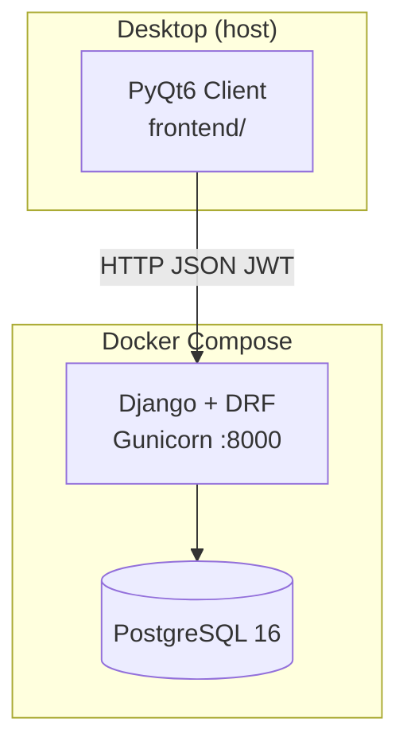
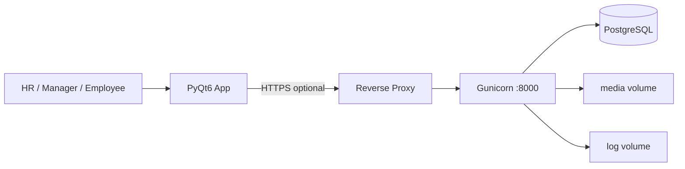
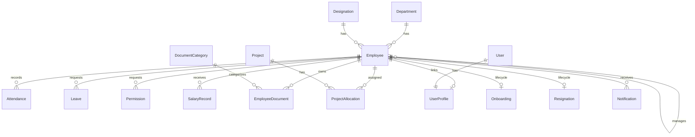
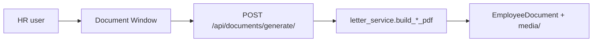
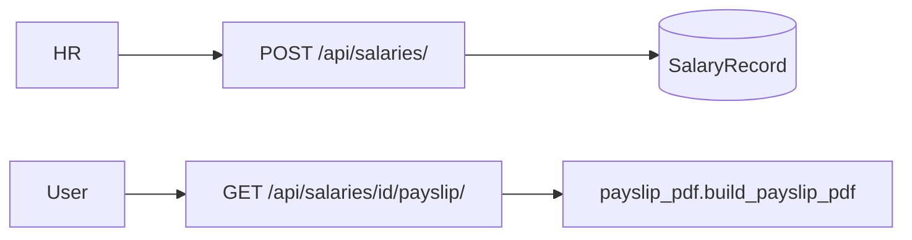
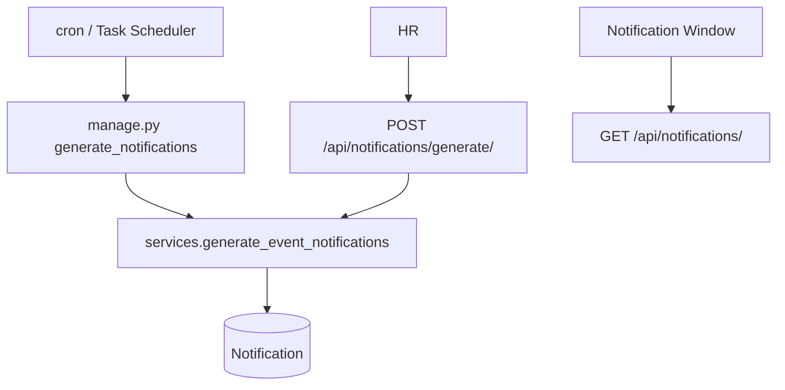
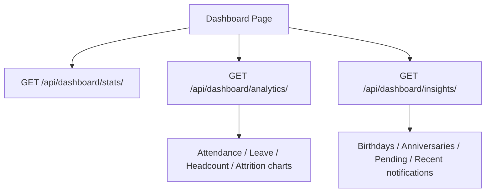

# HRMS — Human Resource Management System

Enterprise-oriented HRMS: **Django REST API** backend, **PostgreSQL** database, **PyQt6** desktop client, **Docker** deployment for API + DB.

| Component | Technology | Runs in Docker? |
|-----------|------------|-----------------|
| Backend API | Django 6 + DRF + SimpleJWT + Gunicorn | Yes |
| Database | PostgreSQL 16 | Yes |
| Desktop UI | PyQt6 | No (host machine) |

**Verified (codebase):** 11 Django apps, 18 domain models, 24 migrations, 63 automated tests, 16 UI screens, 6 management commands, GitHub Actions CI.

See also: [FINAL_AUDIT.md](FINAL_AUDIT.md) · [docs/API_REFERENCE.md](docs/API_REFERENCE.md) · [docs/DEPLOYMENT.md](docs/DEPLOYMENT.md) · [docs/SECURITY.md](docs/SECURITY.md)

---

## Project Overview

Monorepo structure:

```
hrms-system/
├── backend/          # Django project (API + business logic)
├── frontend/         # PyQt6 desktop client
├── scripts/          # PostgreSQL backup/restore scripts
├── screenshots/      # UI screenshots for documentation
├── docs/             # Supplementary guides
├── Dockerfile        # Backend image
├── docker-compose.yml
└── requirements.txt  # Backend Python dependencies
```

The desktop client communicates with the API over HTTP/JSON using JWT. It is **not** containerized.

---

## Features

| Module | Backend | Desktop UI |
|--------|---------|--------------|
| Employees | Departments, designations, employee master, education, bank, ID proofs, emergency contacts | Employees, Departments, Designations |
| Attendance | Records, check-in/out, summary, report, history | Attendance |
| Leaves | Requests, approve/reject, balance, history | Leaves |
| Permissions | Short leave requests, approve/reject | Permissions |
| Projects | Projects, allocations, headcount, self-update | Projects |
| Documents | Upload, categories, download, PDF letter generation | Documents |
| Lifecycle | Onboarding, resignations, joining letter, checklist | Lifecycle |
| Payroll | Salary records, payslip PDF | Payroll |
| Notifications | In-app alerts, unread count, generate events | Notifications |
| Dashboard | Stats, analytics charts, insights | Dashboard |
| Reports | Attendance, leave, payroll, attrition, project headcount | Reports |
| ESS | Self profile via `/api/me/profile/` | Self Service, Directory |
| Auth | JWT, RBAC, audit log | Login |

---

## System Architecture



### Deployment diagram



---

## Technology Stack

| Layer | Version / package (from `requirements.txt`) |
|-------|---------------------------------------------|
| Python | 3.12 (Dockerfile, CI) |
| Django | 6.0.6 |
| DRF | 3.17.1 |
| JWT | djangorestframework-simplejwt 5.5.1 |
| DB driver | psycopg2-binary 2.9.12 |
| API docs | drf-spectacular 0.28.0 |
| CORS | django-cors-headers 4.9.0 |
| WSGI | gunicorn ≥22.0 |
| Desktop | PyQt6 ≥6.6, requests, openpyxl (`frontend/requirements.txt`) |

---

## Folder Structure

### Repository root

| Path | Description |
|------|-------------|
| `.github/workflows/ci.yml` | CI: backend tests, frontend compile, docker build |
| `.env.example` | Docker Compose DB variables |
| `production.env.example` | Production backend template |
| `.gitignore` | Excludes venv, `.env`, logs, media |
| `.dockerignore` | Docker build exclusions |
| `Dockerfile` | Backend image build |
| `docker-compose.yml` | `db` + `backend` services |
| `requirements.txt` | Backend dependencies |
| `FINAL_AUDIT.md` | Release audit report |

### `backend/`

| Path | Description |
|------|-------------|
| `manage.py` | Django entry point |
| `config/` | `settings.py`, `urls.py`, `health.py`, `cycle.py`, `startup.py` |
| `config/showcase/` | Enterprise demo seed (`seed_showcase_data`) |
| `config/management/commands/` | `seed_demo_data`, `seed_showcase_data`, `backup_db`, `audit_permissions` |
| `authentication/` | JWT views, RBAC, audit, groups, UserProfile |
| `employees/` | Employee master data models & API |
| `attendance/` | Attendance models & API |
| `leaves/` | Leave + Permission models & API |
| `projects/` | Project + allocation models & API |
| `documents/` | Document storage, validators, PDF letters |
| `lifecycle/` | Onboarding, resignation, joining letter |
| `notifications/` | In-app notifications |
| `payroll/` | Salary records, payslip PDF |
| `dashboard/` | Stats, analytics, insights, reports (no models) |
| `.env.example` | Backend environment template |
| `.coveragerc` | Coverage config (`fail_under = 70`) |

### `frontend/`

| Path | Description |
|------|-------------|
| `main.py` | **Recommended entry** (crash logging enabled) |
| `login_window.py` | Login screen |
| `dashboard.py` | Main shell (15 menu items) |
| `api_service.py` | REST client (~90+ methods) |
| `ui_helpers.py` | Loading cursor, error dialogs |
| `table_utils.py` | Tables, pagination, export hooks |
| `*_window.py` | Feature screens (16 files) |
| `*_form.py` | Dialog forms (13 files) |
| `.env.example` | `HRMS_API_URL` |

### `scripts/`

| Script | Purpose |
|--------|---------|
| `backup_postgres.ps1` | Windows `pg_dump` backup |
| `backup_postgres.sh` | Linux/macOS `pg_dump` backup |
| `restore_postgres.ps1` | Windows restore |

---

## Database Design

### Models (18)

| App | Models |
|-----|--------|
| employees | `Department`, `Designation`, `Employee`, `Education`, `BankDetails`, `IDProof`, `EmergencyContact` |
| attendance | `Attendance` |
| leaves | `Leave`, `Permission` |
| projects | `Project`, `ProjectAllocation` |
| documents | `DocumentCategory`, `EmployeeDocument` |
| lifecycle | `Onboarding`, `Resignation` |
| notifications | `Notification` |
| payroll | `SalaryRecord` |
| authentication | `UserProfile`, `AuditLog` |

### ER diagram



### Payroll cycle

Pay period uses **26th → 25th** (`config/cycle.py`). `SalaryRecord.period` is `YYYY-MM` of the cycle end month.

---

## API Architecture

- **Base URL:** `http://<host>:8000/api/`
- **Full route list:** [docs/API_REFERENCE.md](docs/API_REFERENCE.md)
- **OpenAPI:** `GET /api/schema/`
- **Swagger UI:** `GET /api/docs/`

### API groups

| Prefix | Domain |
|--------|--------|
| `/api/employees/`, `/departments/`, `/designations/`, … | Employee master |
| `/api/attendance/` | Attendance + actions |
| `/api/leaves/`, `/api/permissions/` | Leave workflows |
| `/api/projects/`, `/api/allocations/` | Projects |
| `/api/documents/` | Documents + generate |
| `/api/onboardings/`, `/api/resignations/` | Lifecycle |
| `/api/notifications/` | Notifications |
| `/api/salaries/` | Payroll |
| `/api/dashboard/` | Dashboard data |
| `/api/reports/` | Report exports |
| `/api/me/` | Identity & self profile |

---

## Authentication Flow

```mermaid
sequenceDiagram
    participant UI as PyQt LoginWindow
    participant API as APIService
    participant S as Django API
    UI->>API: login(username, password)
    API->>S: POST /api/token/
    S-->>API: access + refresh
    API->>S: GET /api/me/
    S-->>API: role + permissions
    Note over API: Store tokens; set Authorization header
    API->>S: Subsequent requests Bearer access
    alt 401 Unauthorized
        API->>S: POST /api/token/refresh/
        API->>S: Retry original request
    end
```

Throttling: login `20/minute`, refresh `60/minute` (configurable via env).

---

## RBAC Architecture

### Roles

| API role | Django group | Data scope |
|----------|--------------|------------|
| `HR` | `HR` | All employees, all modules (write where permitted) |
| `MANAGER` | `Manager` | Self + direct reports |
| `EMPLOYEE` | `Employee` | Self only |

### Permission flags (`GET /api/me/` → `permissions`)

`full_access`, `manage_employees`, `manage_departments`, `manage_designations`, `manage_attendance`, `approve_leave`, `manage_projects`, `view_projects`, `manage_documents`, `manage_lifecycle`, `view_payroll`, `view_reports`, `view_directory`, `view_team`

### Desktop menu rules (`dashboard._menu_visible`)

- **HR** (`full_access`): all 15 menu items
- **Employee:** Dashboard, Directory, Self Service, Notifications
- **Manager:** employee set + Attendance, Leaves, Permissions, Projects, Reports, Payroll
- **HR-limited items:** Employees, Departments, Designations, Documents, Lifecycle use permission flags

### Enforcement

- DRF permission classes in `authentication/permissions.py`
- Queryset scoping in `authentication/rbac.py`

---

## Module flows

### Document generation flow



Letter types: `offer`, `appointment`, `experience`, `relieving`, `warning`, `promotion`.

### Payroll flow



### Attendance flow

Check-in/out via `POST /api/attendance/check-in/` and `check-out/`. Summary and cycle report via custom actions. Cycle boundaries from `config/cycle.py`.

### Notification flow



See [docs/SCHEDULER.md](docs/SCHEDULER.md).

### Dashboard flow



---

## Processing modes explained

| Mode | Backend command | DB | Frontend |
|------|-----------------|-----|----------|
| **Local dev** | `python manage.py runserver 0.0.0.0:8000` | Local PostgreSQL | `python main.py` |
| **Docker** | Gunicorn via compose | Postgres container | `python main.py` → `http://127.0.0.1:8000/api` |
| **Production** | Gunicorn behind HTTPS proxy | Managed PostgreSQL | Desktop clients with production `HRMS_API_URL` |

---

## System requirements

### Hardware (minimum)

| Component | Minimum |
|-----------|---------|
| Dev workstation | 4 GB RAM, 2 CPU cores, 10 GB disk |
| Docker host | 4 GB RAM |
| Desktop clients | 4 GB RAM, 1280×720 display |

### Software

| Software | Version |
|----------|---------|
| Python | 3.12 |
| PostgreSQL | 14+ (16 in Docker) |
| Docker Desktop | Latest (for container deploy) |
| Git | 2.x |
| `pg_dump` / `psql` | For backups (optional locally) |

---

## Prerequisites

1. Python 3.12
2. PostgreSQL (local) **or** Docker Desktop (container deploy)
3. Git

---

## Installation

```powershell
git clone <repository-url>
cd hrms-system
```

### Backend virtual environment

```powershell
cd backend
python -m venv venv
.\venv\Scripts\activate
pip install -r ..\requirements.txt
copy .env.example .env
# Edit backend\.env
```

### Frontend virtual environment

```powershell
cd ..\frontend
python -m venv venv
.\venv\Scripts\activate
pip install -r requirements.txt
copy .env.example .env
```

---

## Local development setup

### PostgreSQL setup

```sql
CREATE DATABASE hrms_db;
CREATE USER postgres WITH PASSWORD 'your_password';
GRANT ALL PRIVILEGES ON DATABASE hrms_db TO postgres;
```

Set in `backend/.env`:

```
DB_NAME=hrms_db
DB_USER=postgres
DB_PASSWORD=your_password
DB_HOST=localhost
DB_PORT=5432
```

### Database migration commands

```powershell
cd backend
.\venv\Scripts\activate
python manage.py migrate
python manage.py makemigrations --check
```

### Seed commands

```powershell
# Minimal demo (hr_demo / mgr_demo / emp_demo, password demo1234)
python manage.py seed_demo_data
python manage.py seed_demo_data --password YourPassword

# Enterprise showcase (60 employees, ABCDEFG Company, password Demo@123)
python manage.py seed_showcase_data
python manage.py seed_showcase_data --password YourPassword

# RBAC maintenance
python manage.py sync_hrms_groups
python manage.py audit_permissions

# Notifications
python manage.py generate_notifications
```

### Running backend

```powershell
cd backend
.\venv\Scripts\activate
python manage.py runserver 0.0.0.0:8000
```

Verify: http://127.0.0.1:8000/api/health/ · http://127.0.0.1:8000/api/docs/

### Running frontend

```powershell
cd frontend
.\venv\Scripts\activate
python main.py
```

---

## Docker setup

```powershell
copy .env.example .env
copy backend\.env.example backend\.env
docker compose build
docker compose up -d
docker compose ps
```

Startup: migrate → collectstatic → gunicorn (see [docs/DEPLOYMENT.md](docs/DEPLOYMENT.md)).

---

## Environment variables

### Backend (`backend/.env`)

| Variable | Required (prod) | Description |
|----------|-----------------|-------------|
| `SECRET_KEY` | Yes | Django secret key |
| `DEBUG` | Yes | `True` dev, `False` production |
| `ALLOWED_HOSTS` | Yes (prod) | Comma-separated hostnames |
| `DB_NAME` | Yes (prod) | PostgreSQL database name |
| `DB_USER` | Yes (prod) | PostgreSQL user |
| `DB_PASSWORD` | Yes (prod) | PostgreSQL password |
| `DB_HOST` | Yes (prod) | `localhost` or `db` in Docker |
| `DB_PORT` | Yes (prod) | Default `5432` |
| `DB_CONN_MAX_AGE` | No | Connection pool seconds (default 60) |
| `DB_CONN_HEALTH_CHECKS` | No | Default `True` |
| `DB_CONNECT_TIMEOUT` | No | Default `10` |
| `CORS_ALLOW_ALL_ORIGINS` | Yes (prod) | Must be `False` in production |
| `CORS_ALLOWED_ORIGINS` | Yes (prod) | Comma-separated origins |
| `STATIC_URL`, `STATIC_ROOT` | No | Static files |
| `MEDIA_URL`, `MEDIA_ROOT` | No | Uploaded files |
| `HRMS_MAX_UPLOAD_BYTES` | No | Default 5242880 (5 MB) |
| `DATA_UPLOAD_MAX_MEMORY_SIZE` | No | Default 10 MB |
| `FILE_UPLOAD_MAX_MEMORY_SIZE` | No | Default 10 MB |
| `LOG_DIR` | No | Default `logs` |
| `LOG_LEVEL` | No | Default `INFO` |
| `DJANGO_LOG_LEVEL` | No | Default `INFO` |
| `TIME_ZONE` | No | Default `Asia/Kolkata` |
| `SESSION_COOKIE_SECURE` | No | Auto `not DEBUG` |
| `CSRF_COOKIE_SECURE` | No | Auto `not DEBUG` |
| `SECURE_SSL_REDIRECT` | No | Auto `not DEBUG` |
| `USE_SECURE_PROXY_SSL_HEADER` | No | Set `True` behind HTTPS proxy |
| `SECURE_HSTS_SECONDS` | No | Default 31536000 when not DEBUG |
| `SECURE_HSTS_INCLUDE_SUBDOMAINS` | No | Default `not DEBUG` |
| `SECURE_HSTS_PRELOAD` | No | Default `False` |
| `JWT_ACCESS_MINUTES` | No | Default `60` |
| `JWT_REFRESH_DAYS` | No | Default `1` |
| `HRMS_LOGIN_THROTTLE` | No | Default `20/minute` |
| `HRMS_TOKEN_REFRESH_THROTTLE` | No | Default `60/minute` |

Templates: `backend/.env.example`, `production.env.example`, `backend/production.env.example`.

### Frontend (`frontend/.env`)

| Variable | Description |
|----------|-------------|
| `HRMS_API_URL` | API base including `/api` (default `http://127.0.0.1:8000/api`) |

### Docker Compose (repo root `.env`)

| Variable | Description |
|----------|-------------|
| `DB_NAME` | Postgres database name |
| `DB_USER` | Postgres user |
| `DB_PASSWORD` | Postgres password (must match volume) |

---

## Running tests

```powershell
cd backend
.\venv\Scripts\activate
python manage.py check
python manage.py test
python manage.py makemigrations --check
```

With coverage:

```powershell
pip install coverage
coverage run --source=authentication,employees,attendance,leaves,projects,documents,lifecycle,notifications,payroll,dashboard,config manage.py test
coverage report
```

Frontend compile check:

```powershell
cd frontend
python -m compileall . -x venv
```

---

## Running CI

Pipeline: `.github/workflows/ci.yml` on push/PR to `main`, `master`, `develop`.

Jobs: backend tests, frontend `compileall`, `docker compose build`.

---

## Backup and restore

### Management command

```powershell
cd backend
python manage.py backup_db
python manage.py backup_db --include-media
python manage.py backup_db --output-dir backups
```

Requires `pg_dump` on PATH.

### Scripts

```powershell
.\scripts\backup_postgres.ps1
.\scripts\restore_postgres.ps1 -DumpFile backups\hrms_hrms_db_YYYYMMDD.dump
```

---

## Health checks

| Endpoint | Purpose |
|----------|---------|
| `GET /api/health/` | Liveness |
| `GET /api/health/ready/` | Readiness (database); returns 503 if DB down |

Docker healthchecks use these endpoints (backend) and `pg_isready` (database).

---

## Logging

| Location | Content |
|----------|---------|
| `backend/logs/hrms.log` | General application log (rotating 5 MB × 5) |
| `backend/logs/hrms-error.log` | ERROR+ only |
| `frontend/logs/hrms-client.log` | Desktop client |
| `frontend/logs/hrms-client-error.log` | Client errors |

Loggers: `hrms`, `hrms.audit`, `hrms.health`, `hrms.startup`, `hrms.api`.

---

## Monitoring

No built-in Prometheus/Grafana. Recommended:

- Poll `GET /api/health/ready/` from load balancer or uptime monitor
- Ship `hrms-error.log` to log aggregator
- Alert on readiness `503` or repeated login failures

---

## Troubleshooting

### Network error on login

1. Confirm backend: `curl http://127.0.0.1:8000/api/health/`
2. Set `HRMS_API_URL=http://127.0.0.1:8000/api` in `frontend/.env`
3. Check `frontend/logs/hrms-client.log`

### Docker: password authentication failed

Align repo `.env` `DB_PASSWORD` with Postgres volume. Reset volume only if data loss acceptable: `docker compose down -v`.

### Session expired immediately

Check JWT expiry (`JWT_ACCESS_MINUTES`). Verify system clock sync.

### `pg_dump not found`

Install PostgreSQL client tools or use Docker: `docker compose exec db pg_dump ...`

### Migrations out of date

```powershell
python manage.py makemigrations --check
python manage.py migrate
```

---

## Common errors

| Error | Cause | Fix |
|-------|-------|-----|
| `ImproperlyConfigured` on startup | Missing prod env vars | Fill `backend/.env` per `production.env.example` |
| `401` on API calls | Expired/missing JWT | Re-login; check refresh flow |
| `403 Forbidden` | RBAC denial | Verify role and employee linkage |
| `Connection refused` | Backend not running | Start runserver or `docker compose up` |
| Import error in frontend | Missing venv packages | `pip install -r frontend/requirements.txt` |

---

## Performance tips

- Backend uses `select_related` on list viewsets (attendance, leaves, employees, etc.)
- Use Docker volumes for media/logs to avoid container layer I/O
- Gunicorn workers: 3 (default in compose); tune per CPU
- Desktop client paginates tables locally (`table_utils.TablePager`)

---

## Security guidelines

See [docs/SECURITY.md](docs/SECURITY.md).

---

## Production deployment

See [docs/DEPLOYMENT.md](docs/DEPLOYMENT.md) and `production.env.example`.

### Production checklist

- [ ] `DEBUG=False`, strong `SECRET_KEY`
- [ ] `ALLOWED_HOSTS`, `CORS_ALLOWED_ORIGINS` set
- [ ] HTTPS reverse proxy + `USE_SECURE_PROXY_SSL_HEADER=True`
- [ ] Firewall PostgreSQL port
- [ ] `migrate` + optional `seed_showcase_data`
- [ ] `sync_hrms_groups` + `audit_permissions`
- [ ] Backup schedule configured
- [ ] Notification schedule configured
- [ ] Desktop clients distributed with correct `HRMS_API_URL`

---

## Upgrade guide

1. Pull latest code
2. `pip install -r requirements.txt` (backend) and `pip install -r frontend/requirements.txt`
3. `python manage.py migrate`
4. `docker compose build && docker compose up -d` (if using Docker)
5. Run `python manage.py test`
6. Run `python manage.py audit_permissions`

---

## Architecture decisions

| Decision | Rationale (from code) |
|----------|----------------------|
| Desktop PyQt6 vs web UI | `frontend/` is PyQt-only; no web SPA in repo |
| JWT stateless API | `REST_FRAMEWORK` uses `JWTAuthentication` only |
| PostgreSQL only | `settings.py` has no SQLite production path; prod requires DB env vars |
| Payroll cycle 26–25 | `config/cycle.py` `CYCLE_START_DAY = 26` |
| Docker: API only | Compose defines `db` + `backend`; no frontend service |
| Groups + profile RBAC | `authentication/groups.py` syncs Django groups from `UserProfile.role` |

---

## Known limitations

1. No web UI — desktop client only
2. No frontend automated tests in CI
3. Project status: `ACTIVE` / `COMPLETED` only (no `ON_HOLD` enum)
4. Leave types: `CL`, `SL`, `EL` only
5. Payroll: salary records + payslip PDF, not full statutory payroll
6. No server-side default pagination on all list endpoints
7. No email/SMS notifications — in-app only
8. CI does not run `docker compose up` integration tests
9. Duplicate `production.env.example` at repo root and `backend/`

---

## Future improvements

- PyQt UI tests (pytest-qt)
- Prometheus metrics endpoint
- Email notifications
- Server-side pagination
- Consolidate duplicate `get_role()` implementations
- Non-root Docker user

---

## Additional features that can be implemented

- Biometric attendance integration
- Org chart visualization
- Bulk CSV employee import
- Two-factor authentication
- API versioning (`/api/v1/`)

---

## Screenshots

Screenshots are in `screenshots/`:

| File | Screen |
|------|--------|
| `login_page.png` | Login |
| `dashboard.png` | Dashboard |
| `employee.png` | Employees |
| `leave.png` | Leaves |
| `project.png` | Projects |
| `documents.png` | Documents |
| `payroll.png` | Payroll |
| `notification.png` | Notifications |
| `api_documentation.png` | Swagger UI |

---

## Demo credentials

### Quick demo (`seed_demo_data`)

| Username | Password (default) | Role |
|----------|-------------------|------|
| `hr_demo` | `demo1234` | HR |
| `mgr_demo` | `demo1234` | Manager |
| `emp_demo` | `demo1234` | Employee |

### Enterprise showcase (`seed_showcase_data`)

| Username | Password (default) | Role |
|----------|-------------------|------|
| `hr.admin` | `Demo@123` | HR |
| `hr.executive` | `Demo@123` | HR |
| `hr.manager` | `Demo@123` | Manager |
| `eng.manager` | `Demo@123` | Manager |
| `sales.manager` | `Demo@123` | Manager |
| `ops.manager` | `Demo@123` | Manager |
| `emp001` … `emp060` | `Demo@123` | Per RBAC assignment |

Company: **ABCDEFG Company** — 60 employees across Chennai, Bangalore, Hyderabad, Pune, Mumbai.

---

## Contributing guide

1. Branch from `develop` (or `main` per team policy)
2. Backend changes: add tests in app `tests.py` or `config/tests/`
3. Run `python manage.py test` and `makemigrations --check`
4. Frontend: `python -m compileall frontend -x venv`
5. Open PR — CI must pass

---

## License

No license file in repository. Add explicit license before public distribution.

---

## FAQ

**Q: Which Python entry point for the desktop app?**  
A: `python main.py` (enables crash logging via `log_config`).

**Q: Where is the API documented interactively?**  
A: http://127.0.0.1:8000/api/docs/ when backend is running.

**Q: Does CORS affect PyQt?**  
A: No. CORS applies to browsers only.

**Q: How many tests?**  
A: 63 tests (`python manage.py test`).

**Q: How do I populate demo data for presentations?**  
A: `python manage.py seed_showcase_data`

**Q: Where is the release audit?**  
A: [FINAL_AUDIT.md](FINAL_AUDIT.md)

---

## Management commands reference

| Command | Description |
|---------|-------------|
| `seed_demo_data` | 3 demo users + minimal employees |
| `seed_showcase_data` | 60-employee enterprise dataset |
| `backup_db` | PostgreSQL SQL dump via `pg_dump` |
| `audit_permissions` | Report UserProfile ↔ group mismatches |
| `sync_hrms_groups` | Sync all profile Django groups |
| `generate_notifications` | Birthday/anniversary/pending alerts |

---

*Documentation generated from repository source. Last verified: 2026-06-28.*
